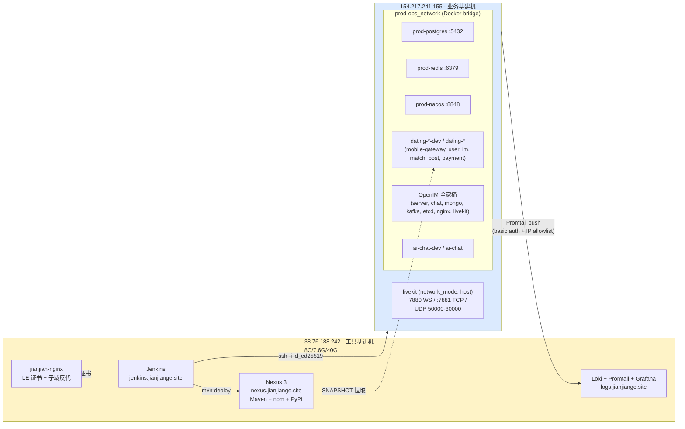
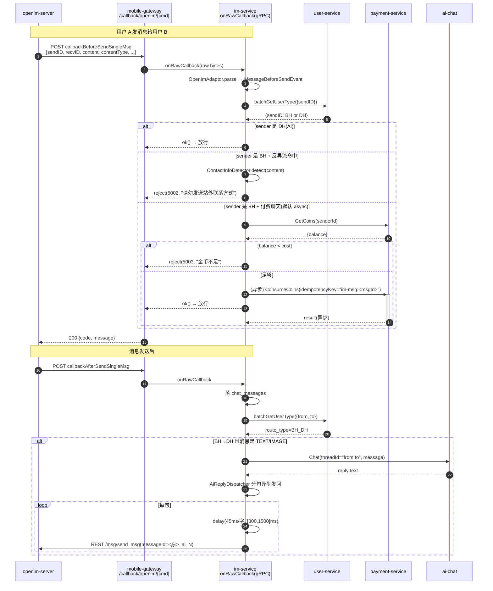
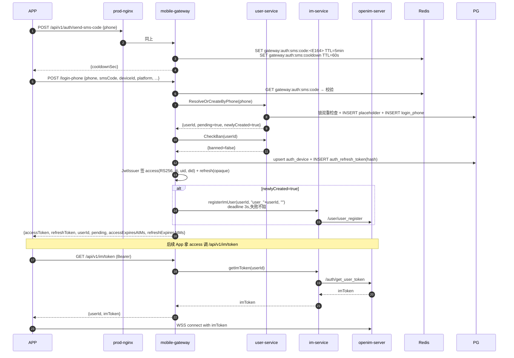
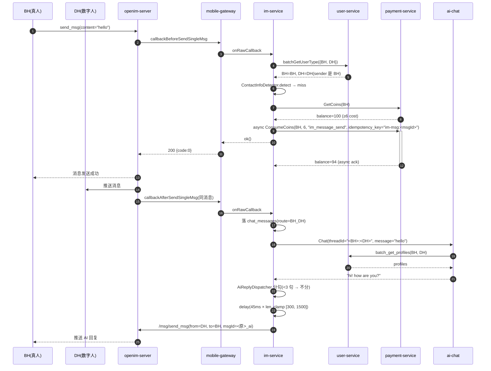
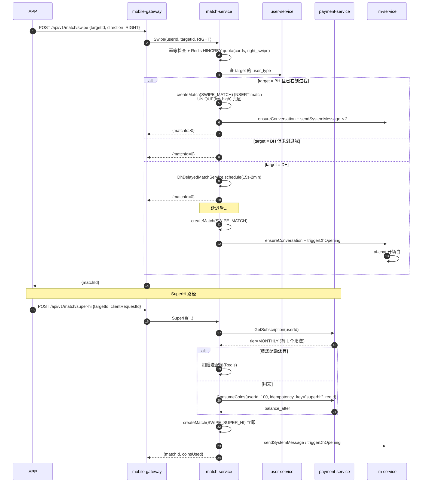

# Vibe / ChatVibe 服务端 技术架构文档
> **范围**:dating-server(Java 后端 monorepo) + ai-chat(Python DH/Vision Agent) + open-im(自建 OpenIM + LiveKit) + proto(三语言接口契约)  
**生成时间**:2026-06-09  
**文档作者**:基于源码逆向 + `docs/*.md` 设计文档汇总  
**App 产品名**:Vibe(对外域名 jianjiange.site),后端代号 dating-server,客户端代号 vibe-*
>

---

## 目录
+ [一、项目概览](#一项目概览)
+ [二、系统架构总览](#二系统架构总览)
+ [三、部署架构与服务器拓扑](#三部署架构与服务器拓扑)
+ [四、Proto 仓库:跨语言接口契约](#四proto-仓库跨语言接口契约)
+ [五、mobile-gateway:对外 REST→gRPC 网关](#五mobile-gateway对外-rest-grpc-网关)
+ [六、user-service:用户档案与召回](#六user-service用户档案与召回)
+ [七、im-service:OpenIM + LiveKit 编排中枢](#七im-serviceopenim--livekit-编排中枢)
+ [八、match-service:推荐与匹配引擎](#八match-service推荐与匹配引擎)
+ [九、post-service:朋友圈与 Feed](#九post-service朋友圈与-feed)
+ [十、payment-service:金币 / 订阅 / 支付](#十payment-service金币--订阅--支付)
+ [十一、ai-chat:数字人(DH) + Vision Agent](#十一ai-chat数字人dh--vision-agent)
+ [十二、OpenIM + LiveKit 部署与回调集成](#十二openim--livekit-部署与回调集成)
+ [十三、典型业务时序图](#十三典型业务时序图)
+ [十四、CI/CD 流水线](#十四cicd-流水线)
+ [十五、工程规范红线](#十五工程规范红线)

---

## 一、项目概览
### 1.1 仓库与定位
| 仓库 | 路径 | 语言 | 部署机 | 职责 |
| --- | --- | --- | --- | --- |
| **dating-server** | `dating-server/` | Java 21 / Spring Boot 3.3.5 | 154.217.241.155 | 7 个业务微服务 monorepo:mobile-gateway / user-service / im-service / match-service / post-service / payment-service(+ example-service 骨架) |
| **ai-chat** | `ai-chat/` | Python ≥3.13 / LangChain / LangGraph | 154.217.241.155 | gRPC 服务,双 servicer:ChatAgent(数字人 DH 对话) + VisionAgent(图像理解 / 颜值打分 / 头像分析) |
| **open-im** | `open-im/` | 配置 + docker-compose | 154.217.241.155 | 自建 OpenIM Server v3.8.3-patch.16 + LiveKit v1.7,提供文字消息与 1v1 音视频 |
| **proto** | `proto/` | .proto + 三语言 stub | — | Java/Python/TypeScript 三语言 gRPC stub,经 Nexus 发布;dating-server / ai-chat / RN App 共用 |


### 1.2 技术栈强约束(CLAUDE.md)
| 类别 | 选型 | 说明 |
| --- | --- | --- |
| 语言 | JDK 21(Java) / Python 3.13 | 容器 `eclipse-temurin:21-jre-alpine` |
| Web | Spring Boot 3.3.5 | 父 POM `spring-boot-starter-parent` |
| ORM | MyBatis-Plus 3.5.x | 单表 CRUD;**禁多表 JOIN**,跨表组装在 service 层多次单表查 |
| RDBMS | PostgreSQL 16 | 唯一持久化数据库;**禁 MySQL** |
| 缓存 | Redis 7 单实例 | key 必须 `<service>:<domain>:<id>` 前缀;cache aside,**禁双写** |
| 对象存储 | MinIO | dev/prod 按 bucket 名隔离,access key 共用 |
| 配置/注册 | Nacos 2.4 | 配置 + 服务发现(gRPC 也走 Nacos);namespace dev/prod 物理隔离 |
| RPC | gRPC 1.68.1 + Protobuf 4.28.3 | 服务间**禁 HTTP 互调**;对外 / App 才走 REST |
| 内部包仓库 | Sonatype Nexus 3 | Maven / npm / PyPI 三协议;`https://nexus.jianjiange.site` |
| IM | OpenIM Server(自建) + LiveKit | 文字走 OpenIM WS:10001,1v1 音视频走 LiveKit SFU;统一经 `im-service` gRPC 编排 |


---

## 二、系统架构总览
### 2.1 整体拓扑


### 2.2 服务清单速查
| 服务 | 语言 | 对外 REST | 对内 gRPC | Nacos 注册名 | 容器名(dev) |
| --- | --- | --- | --- | --- | --- |
| mobile-gateway | Java | `:8080`(经 nginx 公网) | client only | `mobile-gateway` | `dating-mobile-gateway-dev` |
| user-service | Java | `:8080` 仅健康检查 | `:9090` | `user-service` | `dating-user-service-dev` |
| im-service | Java | `:18080` 仅健康检查 | `:18085` | `im-service` | `dating-im-service-dev` |
| match-service | Java | `:8080` 仅健康检查 | `:9090` | `match-service` | `dating-match-service-dev` |
| post-service | Java | `:8080`(也对内) | `:9090` | `post-service` | `dating-post-service-dev` |
| payment-service | Java | `:8080`(PayPal Webhook) | `:9090` | `payment-service` | `dating-payment-service-dev` |
| ai-chat | Python | — | `:50051` | `ai-chat` | `ai-chat-dev` |
| openim-server | Go | — | `:10001 WS` / `:10002 REST` | 不走 Nacos | `openim-server` |
| livekit | Go | — | `:7880 WS / UDP 50000-60000` | 不走 Nacos | `openim-livekit`(host net) |


### 2.3 服务依赖矩阵
| 调用方 ↓ \ 被调 → | user | match | im | post | payment | ai-chat | OpenIM | LiveKit |
| --- | --- | --- | --- | --- | --- | --- | --- | --- |
| mobile-gateway | ✅ | ✅ | ✅ | ✅ | ✅ REST | — | webhook 转发 | — |
| user-service | — | — | — | — | — | — | — | — |
| im-service | ✅ batchGetUserType | — | — | — | ✅ ConsumeCoins/GetCoins | ✅ Chat / Vision | ✅ REST | ✅ Token 签发 |
| match-service | ✅ listDhCandidates / nearbyUsers / batchGetProfile / pickDhCitiesForCaller | — | ✅ ensureConversation / sendSystemMessage / triggerDhOpening | — | ✅ GetSubscription / ConsumeCoins | — | — | — |
| post-service | (planned) | — | — | — | — | — | — | — |
| payment-service | — | — | — | — | — | — | — | — |
| ai-chat | ✅ batchGetProfiles | — | — | — | — | — | — | — |


---

## 三、部署架构与服务器拓扑
### 3.1 双机分工(CLAUDE.md 红线 #9)


**红线**:

+ 38 跑工具(Jenkins / Nexus / Loki),154 跑业务+基建。**两机不互迁**。
+ 生产服务代码**禁止用公网 IP** 访问 PG / Redis / Nacos,容器内必须用 `prod-postgres:5432` / `prod-redis:6379` / `prod-nacos:8848`。
+ OpenIM 中间件(MongoDB / Kafka / Etcd) 业务侧严禁直连,只能经 `im-service` gRPC。

### 3.2 环境隔离三件套
| 资源 | Dev | Prod |
| --- | --- | --- |
| PG 库名 | `dating_chat_dev` | `dating_chat_prod` |
| Redis DB | `1` | `0` |
| Nacos namespace | `dating_chat_dev` | `dating_chat_prod` |
| 容器后缀 | `-dev`(如 `dating-im-service-dev`) | 无(`dating-im-service`) |
| 镜像 Tag | `:dev` | `:prod` |
| JVM 内存 | `-Xms256m -Xmx512m` | `-Xms512m -Xmx1g` |
| `.env` 文件 | `.env.dev` | `.env.prod` |
| Nginx 域名 | `dev.chatvibe.me`(swagger/actuator 开放) | `chatvibe.me`(调试端点 404) |
| OSS bucket | `dating-<svc>-dev` | `dating-<svc>` |


### 3.3 Nginx 反代(prod-nginx,部署在 154)
| URL | Upstream | 备注 |
| --- | --- | --- |
| `https://chatvibe.me/` | `dating-mobile-gateway:8080` | HTTP/2 + gzip + 20MB 上传限制 |
| `https://chatvibe.me/api/v1/auth/*` | 同上 | 登录爆破防护 2r/s burst=3 |
| `https://chatvibe.me/actuator/health` | 同上 | 仅此端点对公网暴露(Cloudflare 健康检查) |
| `https://chatvibe.me/actuator/*` 其他 | 404 | 调试端点对外隐藏 |
| `https://chatvibe.me/swagger-ui/*` | 404 | — |
| `https://chatvibe.me/callback/*` | 404 | OpenIM 回调仅内网直连 mobile-gateway |
| `https://nexus-mind.chatvibe.me/livekit` | `livekit:7880`(host net) | LiveKit WSS 信令 |


Resolver 用 Docker 内置 DNS `127.0.0.11`,valid=10s(lazy resolve,业务容器重启换 IP 时自动刷新)。

---

## 四、Proto 仓库:跨语言接口契约
> **仓库**:`https://gitee.com/jianjiange-site/proto` 独立托管 · **CI**:`/Jenkinsfile`  
**规则**(CLAUDE.md 红线 #4):任何端禁止把 `.proto` 拷进业务源码树,禁止 git submodule,禁止在业务工程跑 protoc。三端仅通过 Nexus 发布的依赖包消费。
>

### 4.1 三语言 stub 发布矩阵
| 端 | 生成器 | 发布到 | 包名约定 | 业务 mirror |
| --- | --- | --- | --- | --- |
| Java | `protobuf-maven-plugin` + `mvn deploy` | `maven-releases` / `maven-snapshots` | `com.jianjiange.proto:user-proto:0.5.0` | `maven-public` |
| Python | `grpcio-tools` + `python -m build` + `twine` | `pypi-hosted` | `jianjiange-proto-user==0.5.0` | `pypi-group/simple/` |
| TS | `ts-proto` + `npm publish` | `npm-hosted` | `@jianjiange/user-proto@0.5.0` | `npm-group/` |


**三语言同版本号同步发版**:每个服务的 `proto/<svc>/VERSION` 文件是单点 source of truth,CI 同时把这个版本号注入三种构建产物。**禁止** `LATEST` / `RELEASE` / 范围版本 / `^` / `~`。

dev 分支自动加后缀:

+ Java: `0.5.0-SNAPSHOT`
+ Python: `0.5.0.dev{BUILD_NUMBER}`(PEP 440)
+ npm: `0.5.0-dev.{BUILD_NUMBER}` + `--tag dev`(不影响 `@latest`)

### 4.2 各 proto 模块清单 + 当前版本
| 模块 | 当前版本 | service 列表(主要 RPC 略,详见各章) |
| --- | --- | --- |
| **user-proto** | **0.5.0** | `UserIdentityService` · `UserProfileService` · `RecommendationService` |
| **im-proto** | **0.6.0** | `ImService`(onRawCallback / sendMessage / getImToken / registerImUser / generateCallToken / sendBusinessNotification) |
| **chat-proto** | **0.1.2** | `ChatAgent`(Chat) |
| **vision-proto** | **0.1.1** | `VisionAgent`(Understand / ScoreFace / AnalyzeProfilePhoto) |
| **payment-proto** | **0.5.0** | `PaymentService` · `CoinService`(GetCoins / AddCoins / AddPaidCoins / ConsumeCoins / GetCoinLedger) |
| **match-proto** | **1.1.0** | `MatchService`(GetTodayFeed / Swipe / SuperHi / ListMatches / GetQuota + Like/Visit 扩展) |
| **post-proto** | **0.3.0** | `PostService`(CreatePost / GetPostDetail / ListUserPosts / ActionLike / Comment / GetRecommendFeed) |


---

## 五、mobile-gateway:对外 REST→gRPC 网关
### 5.1 定位与配置
+ **角色**:Vibe App 移动端的 BFF/REST 网关,集鉴权与请求路由于一身
+ **端口**:HTTP `:8080`(对外经 prod-nginx),内部 gRPC client only
+ **特性**:Spring Boot 3.3.5 + Java 21 virtual threads
+ **Nacos namespace**:`dating_chat_dev` / `dating_chat_prod`,可覆写

### 5.2 数据表
| 表 | 用途 |
| --- | --- |
| `auth_device` | 设备指纹登记,登录时 upsert,刷新时 touchLastSeen;唯一索引 `(user_id, device_id) WHERE NOT deleted` |
| `auth_refresh_token` | 存 SHA-256 hash(64字符)的 refresh token;轮换链表 `rotated_to_id`;`used_at != null` 再被提交触发**reuse detection** → 撤销该用户该设备全部 refresh |


Flyway 用独立历史表 `flyway_history_gateway`,与其他服务的 history 不冲突。

### 5.3 Redis Key
| 前缀 | TTL | 用途 |
| --- | --- | --- |
| `gateway:auth:sms:code:{phoneE164}` | 5 min | SMS 验证码 |
| `gateway:auth:sms:cooldown:{phoneE164}` | 60s | 防短信轰炸 |
| `gateway:auth:blacklist:{jti}` | JWT 剩余有效期 | Access token 拉黑(logout/强制下线) |


### 5.4 JWT 体系
| 项 | 值 |
| --- | --- |
| 签名算法 | **RS256**(RSA + SHA-256) |
| 密钥来源 | `JWT_PRIVATE_KEY_BASE64` / `JWT_PUBLIC_KEY_BASE64`(Nacos/env 注入) |
| Access Claims | `uid` / `did` / `typ="access"` / `jti`(UUID) / `iss="dating-mobile-gateway"` / `iat` / `exp` |
| Refresh Token | **非 JWT**,32-byte SecureRandom base64url,SHA-256 入库;TTL 7 天 |
| 轮换 | 每次刷新发新对 → 旧 refresh 标 `used_at` → 写 `rotated_to_id` |
| Reuse 检测 | 已 used 的 refresh 再被提交 → 撤销该 (userId, deviceId) 全部 refresh + 告警 |
| Filter | `JwtAuthFilter`(HIGHEST_PRECEDENCE+30);白名单 `/api/v1/auth/login-*` / `/refresh` / `/health/**` / `/callback/**` / Swagger / Actuator |


### 5.5 REST 接口清单
#### Auth(`/api/v1/auth`)
| Method | Path | 鉴权 | 业务逻辑 |
| --- | --- | --- | --- |
| POST | `/send-sms-code` | public | `SmsService.issue` → Redis 存 code(5min) + cooldown(60s);mock 模式直接回码 |
| POST | `/login-phone` | public | 验证码 → user-service `ResolveOrCreateByPhone` → `CheckBan` → upsert auth_device → 签发 access+refresh → 落库 token_hash;**新用户**额外调 `im-service.registerImUser`(deadline 3s,失败不阻登录) |
| POST | `/login-third-party` | public | `ThirdPartyTokenVerifier.verify`(Google 真校验/Apple/FB mock) → `ResolveOrCreateByThirdParty` → 同上 |
| POST | `/login-device` | public | 跳过身份验证,直接 `ResolveOrCreateByDevice`(匿名登录) → 同上 |
| POST | `/refresh` | public | `RefreshTokenManager.validate`(hash 反查 + revoked/expired/reuse 检测) → 签新对 → markUsedAndRotate |
| POST | `/logout` | authed | 从 JWT context 取 jti/exp → `TokenBlacklistManager.blacklist` 至过期 + `RefreshTokenManager.revokeByUserDevice` |


#### Profile(`/api/v1/profile`)
| Method | Path | 鉴权 | 业务逻辑 |
| --- | --- | --- | --- |
| POST | `/onboarding` | authed | 首次登录后调用;convert gender enum → proto → `user-service.UpsertOnboarding` |
| PATCH | `/` | authed | 日常编辑(不可改 gender/birthday)→ `user-service.updateProfile` → 删 `user:profile:<id>` 缓存 |


#### Upload(`/api/v1/upload`)
| Method | Path | 鉴权 | 业务逻辑 |
| --- | --- | --- | --- |
| POST | `/presign` | authed | `user-service.presignAvatarUpload` → 返回 5min PUT 签名 URL;客户端直传 OSS,不经 gateway |
| POST | `/confirm` | authed | 客户端 PUT 完成后回报 key → `confirmAvatarUpload` → statObject 校验大小 + 写入 + 删缓存 |


#### Match(`/api/v1/match`)
| Method | Path | 业务逻辑 |
| --- | --- | --- |
| GET | `/feed?count=5` | LPOP Redis feed list 消费 → `match-service.getTodayFeed` → 二次过滤已 block/已 swipe → 回吐卡片批 |
| POST | `/swipe` | `match-service.swipe`(LEFT/RIGHT) |
| POST | `/super-hi` | `match-service.superHi`(订阅赠送 or 扣 100 金币) |
| GET | `/matches` | `match-service.listMatches`(分页游标) |
| GET | `/quota` | `match-service.getQuota`(订阅档位 + 当日消耗) |


#### Home / IM / Callback
| Method | Path | 业务逻辑 |
| --- | --- | --- |
| GET | `/api/v1/home/card?targetId` | BFF 聚合:并发调 `user-service.getProfile(targetId)` + 后续扩展关系/IM 信息 |
| GET | `/api/v1/im/token` | 调 `im-service.getImToken` 下发 OpenIM WSS 凭证 |
| POST | `/api/v1/call/token?peerId` | 调 `im-service.generateCallToken` 签发 1v1 LiveKit token |
| POST | `/callback/openim/{cmd}` | IP 白名单(`CALLBACK_IP_WHITELIST=172.16.0.0/12,127.0.0.1`)→ 透传 raw payload 至 `im-service.onRawCallback` → 原样回传 code |


### 5.6 下游 gRPC client 矩阵
| Client 类 | 服务名 | 主要方法 | 超时 |
| --- | --- | --- | --- |
| `UserIdentityClient` | user-service | resolveOrCreateBy{Phone,ThirdParty,Device} / checkBan | 3s |
| `UserProfileClient` | user-service | getProfile / batchGetProfile / updateProfile / upsertOnboarding / replaceUserInterests / presignAvatarUpload / confirmAvatarUpload | 3s |
| `MatchClient` | match-service | getTodayFeed / swipe / superHi / listMatches / getQuota | 3s |
| `ImClient` | im-service | getImToken / generateCallToken / registerImUser / onRawCallback | 3s |


`GrpcClientMetadataInterceptor` 自动把 JWT 上下文里的 `userId` / `deviceId` + MDC `traceId` 注入 gRPC metadata(`x-user-id` / `x-device-id` / `x-trace-id`),下游无需手动传参。

### 5.7 三方登录与外部集成
+ **Google OAuth**:`GoogleIdTokenVerifier` 在线 JWKS 验签 → 校验 `iss`(accounts.google.com) + `aud`(白名单 `gateway.third-party.google.client-ids`) + `exp`;提取 `payload.sub` 作 thirdPartyUserId
+ **Apple / Facebook**:占位 NOT_IMPLEMENTED(`gateway.third-party.enabled=false` 时进入 mock 模式,`thirdPartyUserId = SHA256(idToken).substring(0,32)`)
+ **AppsFlyer / IAP**:本服务无集成

---

## 六、user-service:用户档案与召回
### 6.1 定位
+ 三能力:**身份解析(登录)** + **档案管理(onboarding + 编辑 + 头像)** + **智能召回(DH/BH 候选)**
+ 端口:gRPC `:9090`,HTTP `:8080` 仅 actuator
+ **无内部 gRPC 下游调用**(纯数据服务)

### 6.2 数据表
| 表 | 主键 | 关键字段 | 用途 |
| --- | --- | --- | --- |
| `user_info` | id (PK) + user_id (业务 UK) | nickname, age, gender, birthday, city_id, lat, lng, beauty_score, race, custom_avatar(JSONB), regulation_status, pending, last_open_at | 用户主档案;`pending=true` 表占位待 onboarding |
| `user_login_phone` | id | user_id, phone_e164, app_name | `(phone_e164, app_name)` 唯一,无软删 |
| `user_third_party_registration` | id | user_id, third_party_login_user_id, platform(1=Google 2=Facebook ...) | 第三方账号绑定,软删后允许重绑 |
| `user_device_registration` | id | user_id, device_id, platform(1=iOS 2=Android 3=Web) | 设备绑定 |
| `user_interest` | id | user_id, tab_key, tag_key, pic_key | 兴趣标签(1:N),`ReplaceUserInterests` 用事务全量替换 |
| `geo_city` | id | city, state_code, state_name, lat, lng, population, source_id | 美国城市字典(SimpleMaps ~28k 行),`user_info.city_id` 引用 |


**关键索引**:`idx_user_info_recall (user_type, gender, city_id, age, beauty_score) WHERE NOT deleted` —— 召回主索引。

### 6.3 Redis 缓存
| Key | TTL | 结构 | 用途 |
| --- | --- | --- | --- |
| `user:profile:{userId}` | 30 min | Hash | GetProfile / BatchGetProfile 命中;写后主动删 |
| `user:profile:big:{userId}` | 30 min | Hash | UserProfileVO + interests 聚合 |
| `user:interest:{userId}` | 30 min | Hash | ReplaceUserInterests 后缓存 |
| `user:ban:status:{userId}` | 5 min | Hash | CheckBan 短缓存 |
| `user:ban:thirdparty-set` | 永久 | Set | 运营手动维护的封禁集 |


**锁前缀**:`lock:user:register:phone:{phoneE164}` / `lock:user:register:thirdparty:{platform}:{thirdPartyUserId}` / `lock:user:register:device:{platform}:{deviceId}` —— Redisson 锁 wait 3s / lease 30s 防注册重复。

### 6.4 gRPC 接口
#### UserIdentityService
| RPC | 业务逻辑 |
| --- | --- |
| `ResolveOrCreateByPhone` | libphonenumber 规范化 E.164 → Redisson 锁双重检查 → 已存在 touchLastOpenAt;不存在事务 insertPlaceholder + insertBinding;返回 `{userId, pending, newlyCreated}` |
| `ResolveOrCreateByThirdParty` | 同上,锁 key 为 `lock:user:register:thirdparty:{platform}:{thirdPartyUserId}` |
| `ResolveOrCreateByDevice` | 同上,锁 key 为 device 维度 |
| `CheckBan` | 先查 Redis 5min 缓存 → miss 查 `user_info.regulation_status ∈ {2=Banned, 5=Suspended}` + Redis Set 运营级三方封禁 → 回写缓存 |


#### UserProfileService
| RPC | 业务逻辑 |
| --- | --- |
| `GetProfile` | cache aside 读取 user_info + interests;返回 UserProfileProto 仅含 object_key,不签 URL |
| `BatchGetProfile` | 入参 ≤200 去重保序 IN 一次捞;interests 单次 IN 加载避免 N+1;**不走缓存** |
| `UpdateProfile` | metadata 取 callerUserId;proto3 optional `hasXxx` 动态 SET;写后删 `user:profile:*` |
| `UpsertOnboarding` | 校验 nickname/gender/birthday 必填;事务一次写 + `pending=false`;删缓存;返回完整 UserProfileVO |
| `ReplaceUserInterests` | 事务 DELETE + INSERT;删 `user:interest:{userId}` |
| `PresignAvatarUpload` | 校验 ext(jpg/png/webp) + size(≤10MB)→ `ObjectStorage.presignedPutUrl` 5min TTL |
| `ConfirmAvatarUpload` | 校验 objectKey 前缀 `avatar/{callerUserId}/` → `headObjectSize` → 更新 `custom_avatar` JSONB → 删缓存 |


#### RecommendationService
| RPC | 业务逻辑 |
| --- | --- |
| `ListDhCandidates(targetGender, age_min/max, beauty_min/max, races[], exclude_user_ids[], limit≤240)` | DB 单表查 `user_type=1(DH) AND gender=? AND ...` ORDER BY beauty_score DESC;不缓存 |
| `NearbyUsers(callerUserId, ..., last_active_within_days)` | 查 caller.city_id → 推 target gender → 同城 BH 召回 + last_active 过滤;无 caller 位置返空 |
| `PickDhCitiesForCaller(callerUserId, dh_user_ids[]≤500)` | caller.state_code 下 geo_city 字典内存加载 → 剔 caller.city_id → 对每个 dh_id `hash(dh_id, caller_id) % cities` 确定性选 |


### 6.5 头像 / OSS 契约
+ **入库只存 object_key**,custom_avatar JSONB `{originalKey, minKey, midKey, width, height}` 均为 key
+ **出参也只回 key**,App 自拼 `${cdnBaseUrl}/${bucket}/${key}`(公开资产无需签名)
+ Presigned URL **只**用于无凭据外部客户端 PUT 上传;内部 RPC 持 AK/SK 直接 SDK 调用,**禁止给自己签 URL**

---

## 七、im-service:OpenIM + LiveKit 编排中枢
### 7.1 定位
+ **OpenIM + LiveKit 的 IM 编排服务**:消息路由 / AI 回复 / 付费聊天 / 反导流 / 推送通知 / 在线状态全链路
+ 端口:gRPC `:18085`,HTTP `:18080`(健康检查;OpenIM 回调由 gateway 转 gRPC,**不**走 HTTP)
+ 所有 IM 能力由这个服务统一封装,其他服务**不直接持** OpenIM admin secret / LiveKit API key(CLAUDE.md 红线 #7)

### 7.2 依赖
| 依赖 | 协议 | 作用 |
| --- | --- | --- |
| OpenIM Server | REST `:10002` + Webhook | 用户注册 / Token 签发 / 消息发送 / 业务通知;admin secret 在 `openim.admin-secret` |
| LiveKit | 无直连仅签 Token | HS256 JWT(`apiKey + secretKey`);room 名 `call_<8位UUID>` |
| payment-service | gRPC | `CoinService.ConsumeCoins`(扣币+幂等)/ `GetCoins`(余额读) |
| user-service | gRPC | `batchGetUserType`(区分 BH/DH);user-service 端 Redis 已有缓存,im-service 不再加二级缓存 |
| ai-chat | gRPC `:50051` | `ChatAgent.Chat`(threadId 作 LangGraph checkpoint key) |
| PostgreSQL | JDBC | `chat_messages`(消息历史) + `user_online_session`(在线时长) |
| Redis | TCP | `im:presence:online` ZSet 在线用户集 |


### 7.3 数据表
#### `chat_messages`
| 列 | 说明 |
| --- | --- |
| message_id (PK) | `openim_<serverMsgID>` / `openim_c_<clientMsgID>` / fallback |
| from_user_id / to_user_id | OpenIM userId |
| content | TEXT |
| type | ENUM(TEXT, IMAGE, AUDIO, VIDEO, FILE, CUSTOM) |
| route_type | `BH_BH` / `BH_DH` / `DH_BH` / `DH_DH` |
| timestamp | BIGINT 秒级(OpenIM sendTime/1000) |


#### `user_online_session`
| 列 | 说明 |
| --- | --- |
| id (PK) | bigserial |
| user_id | 业务 userId |
| online_at / offline_at / duration_seconds | 上线下线时长(下线时回填;孤儿兜底按阈值封顶) |


### 7.4 OpenIM 回调闭环


### 7.5 回调命令矩阵
| OpenIM callbackCommand | Event 类型 | Handler | 响应 |
| --- | --- | --- | --- |
| `callbackBeforeSendSingleMsgCommand` | MessageBeforeSendEvent | BeforeSendHandler | **allow / reject(code∈[5000,9999])** |
| `callbackAfterSendSingleMsgCommand` | MessageSentEvent | MessageSentHandler | record only;BH→DH 异步调 ai-chat;always `ok()` |
| `callbackUserOnlineCommand` | UserOnlineEvent | PresenceHandler.online | ZADD `im:presence:online`;首次开 PG session |
| `callbackUserOfflineCommand` | UserOfflineEvent | PresenceHandler.offline | 算 duration → 关 PG session → 删 Redis |
| 其他 | UnknownEvent | — | log + `ok()` |


### 7.6 Before-Send 三层决策(`BeforeSendHandler`)
1. **发送方无法解析** → 放行(warn)
2. **发送方是 DH(AI)** → 放行(不检测、不扣币;避免误伤 AI 回复)
3. **反导流** → 仅 TEXT,`ContactInfoDetector` 命中 US phone / instagram.com / facebook.com / m.me / wa.me / t.me / 关键词 ig/insta/fb/whatsapp/telegram → **reject(5002)**
4. **付费聊天**:
    - 同步只读余额做准入:`GetCoins(senderId)` < cost → **reject(5003)**
    - 异步扣:`CoinChargeDispatcher.chargeAsync` → `ConsumeCoins(idempotencyKey="im-msg:<messageId>")`
    - payment 故障 fail-close → **reject(5004) + [CHARGE_FAIL] ERROR log**

**Nacos 热更新**:`im.message.charge.coin-cost`(每条金币数) / `im.message.anti-funnel.enabled`。

### 7.7 gRPC 接口
| RPC | Req → Resp | 调用方 | 关键逻辑 |
| --- | --- | --- | --- |
| `onRawCallback` | `RawCallback{provider, payload}` → `{success, code, message}` | mobile-gateway | adaptor.parse → dispatcher.dispatch → CallbackResult |
| `sendMessage` | `SendMessageRequest{fromUserId, toUserId, content, type, ...}` → `{success, message, messageId}` | match-service 等需主动推消息的服务 | OpenImSender → REST `/msg/send_msg`;**不触发 before-send** |
| `getImToken` | `{userId}` → `{userId, imToken}` | mobile-gateway | OpenIM `/auth/get_user_token`;空则 **lazy-register**(`registerUser(userId, "user_"+userId, "")`)后重试 |
| `registerImUser` | `{userId, nickname, avatarUrl}` → `{success, userId}` | mobile-gateway 登录链路 + user-service onboarding | OpenIM `/user/user_register`;errMsg/errDlt 含 `registered`/`exist` 视为成功(幂等) |
| `generateCallToken` | `{userId, peerId}` → `{token}` | mobile-gateway `/call/token` | HS256 JWT;claims `{video:{room:"call_<UUID8>", roomJoin, canPublish, canSubscribe}}`;TTL `livekit.ttl-minutes` |
| `sendBusinessNotification` | `{sendUserId, recvUserId/recvGroupId, key, data, sendMsg, reliabilityLevel}` → `{success, clientMsgId, serverMsgId, sendTime}` | match-service(match_success / match_welcome / typing) | OpenIM `/msg/send_business_notification` → 客户端 `OnRecvCustomBusinessMessage` 回调 |


### 7.8 AI 路由细节
+ **threadId 设计**:`{fromUserId}:{toUserId}` 作 LangGraph checkpoint key(同一对用户跨多轮共享上下文)
+ **触发条件**:`route_type=BH_DH` 且 type ∈ {TEXT, IMAGE}
+ **IMAGE 特殊**:从 OpenIM PictureElem 提 image_url → `VisionAgent.Understand` 转文本描述 → `[Image] <描述>`;URL 缺失/失败用 `IMAGE_BROKEN_PLACEHOLDER`
+ **回复分句**:`SentenceSplitter` 句末标点切;`≥3 句 AND ≥30 字` 才分多条,否则合并
+ **打字节奏**:45ms/字,clamp `[300, 1500]ms`
+ **消息 ID**:`<原id>_ai` 或 `<原id>_ai_1..N`
+ **顺序保证**:同一回复的多条由同一线程池任务顺序执行

### 7.9 业务通知 Key 列表
| key | Payload | 持久化 | Reliability | 场景 |
| --- | --- | --- | --- | --- |
| `typing` | TypingPayload | false | 1(online push) | 用户正在输入 |
| `match_success` | MatchSuccessPayload | false | 1 | 卡牌匹配成功在线通知 |
| `match_welcome` | MatchWelcomePayload | true | 2(guaranteed) | 匹配欢迎进消息列表 |


### 7.10 兜底 / 幂等点速查
| 场景 | 兜底 |
| --- | --- |
| `getImToken` 为空 | lazy-register(`registerUser` 幂等)后重试 |
| user-service RPC 故障 | 缺 type → 默认 BH(record-only 安全) |
| `ConsumeCoins` 失败 | fail-close `reject(5004)` + ERROR 日志 |
| async 扣穿 | 记 ERROR + 计数告警;接受漏扣;`idempotency_key` 重试幂等 |
| ai-chat 故障 | log.error + 对话不中断 |
| VisionAgent 失败 | `IMAGE_BROKEN_PLACEHOLDER` 给 DH 看 |
| 在线孤儿超 26h | `PresenceSweepJob` (cron `0 */30 * * * *`)收口 |


---

## 八、match-service:推荐与匹配引擎
### 8.1 定位
+ Vibe 首页"划卡即匹配"的推荐引擎与配对管理
+ feed 卡片队列生成(D0 冷启动 / D1 日更)、划卡(LEFT/RIGHT/SUPER_HI)、实时配对、互动记录(Like/Visit)、DH 延迟匹配
+ 端口:gRPC `:9090`,HTTP `:8080` 仅健康检查

### 8.2 数据表
| 表 | 主键 / 关键索引 | 用途 |
| --- | --- | --- |
| `user_swipe_history` | (user_id, swiped_at DESC) / (target_user_id, direction) | 划卡历史权威;`direction` 1=LEFT 2=RIGHT 3=SUPER_HI;`target_user_type` 1=BH 2=DH;UNIQUE `(user_id, target_user_id)` |
| `match` | (user_id_low, matched_at DESC) / (user_id_high, matched_at DESC) | 匹配关系;UNIQUE `(user_id_low, user_id_high)` 防重复;CHECK `user_id_low < user_id_high` |
| `match_outbox` | (next_retry_at) WHERE status='PENDING' | im-service 副作用 outbox 重试(ENSURE_CONVERSATION / SYSTEM_MSG / DH_OPENING) |


队列、配额、DH pending 延迟**全部走 Redis**,不再单独建表。

### 8.3 Redis Key
| Key | 类型 | TTL | 用途 |
| --- | --- | --- | --- |
| `match:quota:{userId}:{yyyymmdd}` | HASH | 36h | 日配额(right_swipe/cards/super_hi)HINCRBY 原子累加 |
| `match:feed:{userId}` | LIST | 7d | 推荐队列;元素 `"<targetId>:<targetType>"`;RPUSH 入队 / LPOP 消费;空时触发实时重建 |
| `match:swiped:{userId}` | SET | 永久 | 已 swipe target;消费二次过滤 |
| `match:pref:{userId}` | HASH | 24h | D1 cron 生成的偏好画像(age_mean/std, beauty_mean/std, race_dist, dh_bh_ratio) |
| `user:online:rank` | ZSet | 永久 | **由 user-service 维护**;member=userId,score=心跳 ms;最近 60s 在线 |
| `lock:match:d1:{yyyymmdd}` | Redisson RLock | 1h | D1 cron 分布式锁 |
| `lock:match:swipe:{user}:{target}` | Redisson RLock | 5s | 单次 swipe 串行化 |


### 8.4 gRPC 接口
| RPC | 业务逻辑 |
| --- | --- |
| `GetTodayFeed(userId, count≤20)` | 检查 cards 配额 → LPOP `match:feed:*`,不足触发 `ColdStartService.buildAndPush` 实时双池召回 → SMISMEMBER 二次过滤已 swipe → `user-service.batchGetProfile` 拼卡片 → DH 走 `pickDhCitiesForCaller` city override |
| `Swipe(userId, targetId, direction)` | 幂等检查→已 swipe 返上次结果不扣配额;LEFT/RIGHT 都扣 cards,RIGHT 额外扣 right_swipe;查 target 类型: BH 互划立即 match(SWIPE_MATCH) / DH 调度 15s-2min 延迟(`DhDelayedMatchService` 进程内 TaskScheduler);match 表 UNIQUE 兜底 |
| `SuperHi(userId, targetId, clientRequestId)` | 先用 Super Hi 订阅赠送配额 → 无则扣 100 金币(`payment.ConsumeCoins(idempotencyKey="superhi:"+clientRequestId)`);**立即** match(SWIPE_SUPER_HI),无视对方意愿;BH 收系统消息,DH 触发 ai-chat 开场白 |
| `ListMatches(userId, pageSize≤100, pageToken)` | 按 `(low=uid OR high=uid) AND NOT deleted` 查,`matched_at DESC` 分页 |
| `GetQuota(userId)` | Redis HASH 当前消耗 + `payment.GetSubscription`(5min cache)→ QuotaConfig 按 tier 上限 |


### 8.5 推荐与排序
#### D0 冷启动(实时召回)
+ 触发:无历史 / 首登 / LIST 空
+ 召回两池各目标 240:
    - DH:`listDhCandidates(targetGender, age±, beauty±, sameRace, exclude)`
    - BH:`nearbyUsers(callerUserId, age±5, beauty±15, sameRace, radius≤100km, active≤7d, exclude)` 严格单层不放宽
+ 排序键(字典序,无打分):
    - BH:`isNewBh(创建 ≤3 天) DESC → sameRace DESC → |ageDiff| ASC → beautyScore DESC`
    - DH:`sameRace DESC → |ageDiff| ASC → beautyScore DESC`
+ Merge:`bh_ratio`(默认 0.20,Nacos `match.cold-start.bh-ratio`)→ `interleave(BH, DH)` 每 round(1/bhRatio) 张 DH 间塞 1 张 BH

#### D1 日更(离线生成)
+ 触发:每日 UTC 07:00,前置"昨天有划卡"
+ 偏好建模(30 天右划聚合):`age_mean/std` `beauty_mean/std` `race_dist` `dh_bh_ratio`;样本 <10 退化中性
+ 召回:同上但范围更宽(BH `radius_km=200`)
+ 打分:

```plain
S(c) = 0.45 × prefSim(c, pref)          # age/beauty 高斯 + race 占比
     + 0.30 × normalize(beautyScore)
     + 0.15 × distanceDecay(c)          # exp(-d/50km);DH 固定 0.5
     + 0.10 × activityScore(c)          # exp(-days/7);DH 固定 0.5
     + mutual_like_bonus(c)             # BH only: +0.20 if 对方曾右划
     + new_bh_bonus(c)                  # BH only: +0.20 if 注册≤3 天
```

+ 取 top 240,无 MMR / ε-greedy
+ Merge:L1 基础 `bh_ratio=0.40` + L2 个性化偏移 `(0.5 - dh_bh_ratio) × 0.40`(clamp ±0.20)
+ DEL + RPUSH 覆盖

### 8.6 匹配矩阵
| 场景 | target | 对方状态 | 动作 | match.source |
| --- | --- | --- | --- | --- |
| 右划 | BH | 已右划过我 | 立即 match + 系统消息 | SWIPE_MATCH |
| 右划 | BH | 未划/左划我 | 仅写历史 | — |
| 右划 | DH | — | 延迟 15s-2min match | SWIPE_MATCH |
| SUPER_HI | BH | — | 立即 match + 系统消息 | SWIPE_SUPER_HI |
| SUPER_HI | DH | — | 立即 match + ai-chat 开场 | SWIPE_SUPER_HI |
| 左划 | 任意 | — | 仅写历史 | — |


### 8.7 配额表(`docs/match-service-prd-tech.md`)
| Tier | 每日右划 | 每日卡片 | 每日 Super Hi 赠送 |
| --- | --- | --- | --- |
| FREE | 5 | 50 | 0 |
| WEEKLY | 10 | 80 | 0 |
| MONTHLY | 15 | 120 | 1 |
| YEARLY | 15 | 120 | 1 |


每天 UTC 00:00 重置;Super Hi 用完后仍可花 100 金币购买。

### 8.8 定时任务
| Job | Cron / 间隔 | 锁 |
| --- | --- | --- |
| D1QueueScheduler | `0 0 7 * * *` UTC | ShedLock `match-d1-queue` 1h |
| MatchOutboxRetry | fixedDelay 30s + 指数退避 | 单实例即可 |
| OnlinePlanGenerator(DH like/visit) | fixedDelay 60s | Redisson `lock:match:dh_plan:online_sweep` |
| OfflinePlanGenerator | fixedDelay 20min | Redisson `lock:match:dh_plan:offline_sweep` |
| LikeVisitorTaskExecutor | fixedDelay 60s | Redisson `lock:match:dh_plan:executor` |


---

## 九、post-service:朋友圈与 Feed
### 9.1 定位
+ 朋友圈动态发布 + 互动(点赞 / 评论) + Feed 推荐引擎
+ 双协议:gRPC `:9090` + REST `:8080`

### 9.2 数据表
| 表 | 主键 / 索引 | 用途 |
| --- | --- | --- |
| `post` | post_id (PK,雪花) / `(user_id, created_at DESC)` | 主帖;`status`(1=正常 0=删除 2=审核中);`deleted` 软删 |
| `post_image` | (post_id, sort_order) PK | 单帖最多 9 张图,存 `image_key`(OSS 对象 key) |
| `post_stat` | post_id PK | DB 基准值 `like_count` / `comment_count`,5min 周期由 Redis 增量回填 |
| `post_like` | (user_id, post_id) PK | 点赞幂等;`status` 1=点赞 0=取消 |
| `post_comment` | comment_id (PK,bigserial) / `(post_id, root_id, created_at DESC)` | 评论;`root_id`/`parent_id`/`reply_to_user_id` 楼中楼预留(初期单层) |


### 9.3 Redis Key
| Key | 结构 | TTL | 用途 |
| --- | --- | --- | --- |
| `post:detail:{postId}` | HASH | 7d | 帖子详情缓存 |
| `post:stat:incr:{postId}:likes` / `:comments` | STRING | 7d | 增量计数器(未刷盘) |
| `user:timeline:{userId}` | ZSET | 7d | 朋友圈时间线(分数=发布时间,最多 100 条) |
| `feed:cold_start:pool:{male,female}` | ZSET | 7d | 冷启动池(score=发帖时间戳) |
| `feed:pool:recommend:{male,female}` | ZSET | 7d | 最终推荐池(score=热度,最多 3000 条) |
| `post:comments:{postId}` | ZSET | 7d | 评论 ID 列表(最多 200 条) |
| `updated_posts_set` | SET | 7d | 当前周期有更新的 postId 集合(LikeFlushJob 用) |
| `user:read:bloom:{userId}` | Redisson Bloom | 7d | 已读 postId 布隆过滤(容量 5000,误率 1%) |


### 9.4 gRPC / REST 接口
| Method | REST Path | gRPC | 逻辑 |
| --- | --- | --- | --- |
| POST | `/v1/posts` | CreatePost | 雪花生成 postId → post/image/stat 三表 → cache `post:detail` → 加 `feed:cold_start:pool:{gender}` → 异步 fanout(`PostFanoutService`)写所有粉丝 timeline |
| GET | `/v1/posts/{postId}` | GetPostDetail | 读 post + images + stat 基准 + Redis 增量 → 检查 `isLiked(userId, postId)` |
| POST | `/v1/posts/{postId}/like` | ActionLike | `PostLikeManager.upsert` 幂等 → Redis 增量 ±1 → 加 `updated_posts_set` 等 60s flush |
| POST | `/v1/posts/{postId}/comments` | CreateComment | INSERT post_comment + Redis ZSET 缓存 200 条 + 增量 +1 |
| GET | `/v1/posts/{postId}/comments` | ListComments | 优先 Redis ZSET → miss 回源 root_id=0 一级评论 |
| DELETE | `/v1/comments/{commentId}` | DeleteComment | 校验 owner → 软删 + 清缓存 + 增量 -1 |
| DELETE | `/v1/posts/{postId}/delete` | DeletePost | 校验 owner → 软删 + 清 `post:detail` + 从 `feed:cold_start:pool:*` 移除 |
| GET | `/v1/users/{userId}/posts` | ListUserPosts | postId 倒排分页 + batchIsLiked + 合并 Redis 增量 |
| GET | `/v1/feed/recommend` | **GetRecommendFeed** | **三路融合** ↓ |


### 9.5 推荐 Feed 三路融合
```plain
1. 热度排序池 feed:pool:recommend:{gender}
   score = (10 + likeCount + 3*commentCount) / (hoursDiff + 2)^1.5
   反向读 pageSize*3 个候选
2. 好友时间线 user:timeline:{userId}
   近 7 天粉丝发帖,最多 4 条,位置 3/6 强插
3. 冷启动池 feed:cold_start:pool:{gender}
   最新同性发布,按时间倒排

Merge pattern: [1,2(rec) → 3(friend) → 4,5(rec) → 6(cold) → 7-10(rec)]
布隆去重 user:read:bloom:{userId}(容量 5000,误率 1%)→ 加进 bloom 7d
```

### 9.6 定时任务
| Job | 频率 | ShedLock | 逻辑 |
| --- | --- | --- | --- |
| `FeedScoreJob` | fixedRate 5min | `PT10M` / `PT10S` | 查最近 3 天帖 → 算热度 score → 按性别加 `feed:pool:recommend:{gender}:tmp` → 限 top 3000 → rename tmp → final |
| `LikeFlushJob` | fixedRate 60s | `PT2M` / `PT5S` | `updated_posts_set` SRANDMEMBER 100 → Lua 原子读取增量(读后置 0) → `post_stat.like_count += delta` → SREM |


### 9.7 图片处理
+ 客户端上传 OSS 后获取 `object_key` → CreatePost 入参 `image_keys`(0-9 张,≤128 字符)
+ 后端**只存 key**,出参原值返回,客户端经 CDN/OSS 直接访问
+ 推荐 key 格式:`post/{userId}/{postId}/image_{i}.{ext}`,后端不强制

---

## 十、payment-service:金币 / 订阅 / 支付
### 10.1 定位
+ 统一支付网关:**金币账户**(免费 + 付费分层)+ **订阅档位**(FREE/WEEKLY/MONTHLY/YEARLY)+ **第三方支付**(目前 PayPal 已落地,IAP/GooglePay/Stripe 预留)
+ gRPC `:9090` + REST `:8080`

### 10.2 数据表
| 表 | 关键字段 | 用途 |
| --- | --- | --- |
| `coin_accounts` | user_id PK / balance / paid_balance / version | 余额 = balance + paid_balance;**消费优先扣免费,再扣付费**;乐观锁 version |
| `coin_ledger` | user_id INDEX / type(INCOME/EXPENSE) / amount / paid_amount / balance_after / paid_balance_after / reason / extra(JSONB) / **idempotency_key** | Append-only 流水;`UNIQUE(user_id, idempotency_key) WHERE NOT NULL` 实现幂等 |
| `user_subscription` | user_id / tier(1=FREE 2=WEEKLY 3=MONTHLY 4=YEARLY) / expires_at / source(IAP_APPLE/IAP_GOOGLE/TEST/ADMIN) | UNIQUE `(user_id) WHERE NOT deleted`;过期或无记录 → FREE |
| `payment_orders` | order_id UK / status(INIT/PAID/FAILED) / refund_status / ext_transaction_id / notify_status | 支付订单 |


### 10.3 gRPC 接口
#### CoinService
| RPC | 调用方 | 逻辑 |
| --- | --- | --- |
| `GetCoins(userId)` → balance | im-service before-send 准入 | 查 `coin_accounts`,无记录返 0;**无写,无锁** |
| `ConsumeCoins(userId, amount, reason, extra, idempotency_key)` → balance_after | im-service / match-service SuperHi(`superhi:<clientRequestId>`) | ①幂等检查:`(user_id, key)` 已存在 → 直接返上次 balance_after;②余额校验,不足返 3001;③分层扣(免费先扣,paid 补);④乐观锁 update + version+1;⑤插 ledger(`UNIQUE` 兜底重复返历史) |
| `AddCoins(userId, amount, reason)` → balance | admin / 奖励 | INSERT or 乐观锁 UPDATE balance + ledger INCOME |
| `AddPaidCoins(userId, amount, reason)` → balance | PaymentService.grantReward(PayPal 成功) | 同 AddCoins 但操作 paid_balance |
| `GetCoinLedger(userId, page, size)` | admin | 流水分页 |


#### PaymentService
| RPC | 逻辑 |
| --- | --- |
| `CreateOrder({product_id, payment_method=PAYPAL, currency, platform, user_id})` | `PaypalExecutor.createOrder` → OAuth2 token → POST `/v2/checkout/orders` (intent=CAPTURE, `PayPal-Request-Id` 防重) → INSERT `payment_orders(INIT)` → 返 `{order_id, checkout_url, ext_order_id}` |
| `VerifyPayment({order_id, ext_order_id, payment_method})` | `captureOrder(ext_order_id)` → 更新订单 PAID → `grantReward`:订阅商品 → `SubscriptionService.activateSubscription`;金币商品 → `CoinService.addPaidCoins` |
| `HandleWebhook` | 通用 webhook 路由(预留) |
| **REST POST **`/v1/payments/webhook/paypal` | PayPal Webhook,raw body 验签:headers `paypal-transmission-id/time/sig/cert-url/auth-algo` → POST `/v1/notifications/verify-webhook-signature` → 处理 `PAYMENT.CAPTURE.COMPLETED` / `DENIED` / `REFUNDED` / `CHECKOUT.ORDER.APPROVED`(兜底 capture) |
| `GetSubscription(userId)` → `{tier, expires_at, is_active}` | match-service GetQuota 调;`expires_at >= NOW() AND tier > FREE` → active;否则 FREE |
| `BindWithdrawAccount` / `Withdraw` | 提现链路(实现中) |


### 10.4 第三方支付
| 渠道 | 状态 | 关键接口 |
| --- | --- | --- |
| **PayPal** | ✅ 已实现 | OAuth2 `/v1/oauth2/token` → `/v2/checkout/orders` + `/capture` + 官方 `/v1/notifications/verify-webhook-signature` 验签(不本地 cert 验签) |
| Apple App Store Server API v2 | 预留 | 计划 JWT 私钥签 + `/inapp/v1/subscriptions/{originalTransactionId}/transactions`,接 Server Notification v2 |
| Google Play | 预留 | `androidpublisher/v3/.../tokens/{token}/acknowledge` |
| Stripe | 预留 | Webhook HMAC SHA256 签名验证 |


### 10.5 幂等键约定
| 场景 | key 来源 |
| --- | --- |
| ConsumeCoins(SuperHi) | `"superhi:" + client_request_id`(match-service 提供) |
| ConsumeCoins(IM 消息) | `"im-msg:" + messageId`(im-service 提供) |
| PayPal 创建订单 | `PayPal-Request-Id = order_id` |
| Withdraw | 调用方 UUID |


### 10.6 与上游对接边界
```plain
im-service ─── GetCoins/ConsumeCoins(im-msg:<msgId>) ──> payment
match-service ─ GetSubscription / ConsumeCoins(superhi:<reqId>) → payment
mobile-gateway ─ REST /v1/payments/orders / verify ────> payment
PayPal ───────── Webhook /v1/payments/webhook/paypal ─→ payment
```

---

## 十一、ai-chat:数字人(DH) + Vision Agent
### 11.1 定位
+ 基于 LangChain / LangGraph 的 gRPC AI 服务:
    - **ChatAgent**:数字人(DH)拟人化对话
    - **VisionAgent**:图像理解 + 颜值打分 + 头像分析
+ **单进程双 servicer**,gRPC `:50051`(`GRPC_LISTEN_ADDR` 可覆写)
+ 启动:`python -m server`

### 11.2 技术栈
| 组件 | 选型 |
| --- | --- |
| Python | ≥3.13 |
| gRPC | `grpcio>=1.60.0` |
| Agent 框架 | LangChain ≥1.2.15 + LangGraph ≥0.3.0(PostgreSQL checkpointer) |
| Chat LLM | DeepSeek `deepseek-v4-flash`(temp 0.7,thinking 禁用) |
| Vision LLM | Groq `meta-llama/llama-4-scout-17b-16e-instruct` + Gemini `gemini-3.1-flash-lite`,`SmartRouterMiddleware` round_robin + 熔断 30s |
| Checkpointer | PostgreSQL(`langgraph-checkpoint-postgres`),threadId 分隔 |
| 服务发现 | Nacos 2.5.1(可选;无 Nacos 走 `USER_SERVICE_ADDR` 静态直连) |


### 11.3 目录结构
```plain
chat_agent/
├── builder.py            # build_agent() 构图 + @dynamic_prompt 注入 UserContext
├── servicer.py           # ChatAgentServicer.Chat() RPC
├── intent_classifier.py  # 意图分类:快路关键词 + 门控 LLM
└── prompts/              # system.md / intent_classification.md / dating_summary_prompt.md

vision_agent/
├── builder.py            # build_understand_agent / build_score_agent / build_profile_agent
├── servicer.py           # 三个 RPC + JSON 解析兜底
└── prompts/              # understand_system.md / face_score_system.md / profile_photo_system.md

core/
├── config.py             # Settings.from_env()
├── llm.py                # build_chat_llm / build_vision_models 工厂
├── middlewares/smart_router.py    # 轮询 + 熔断 + 冷却
├── clients/user_client.py         # UserService gRPC 包装 + Nacos resolver + reconnect 重试
└── nacos_client/                   # 注册/发现/订阅/配置
```

### 11.4 gRPC 接口
#### ChatAgent.Chat
```plain
req: {thread_id, from_user_id, to_user_id, message}
resp: {content}
```

调用方:**im-service**(BH→DH 路由)

逻辑:

1. 校验 thread_id 必填,from/to user_id 必须有效整数
2. `UserServiceClient.get_bh_and_dh_users(bh_id, dh_id)` 单次 RPC 并行拉双方档案
3. 按 thread_id 从 PG checkpointer 读历史(首消息则空)
4. 意图分类器:L1 快路关键词 + L2 门控 LLM(轮次 ≥5 才调,降本)→ primary_intent + confidence + flags → 注入 system prompt 的 Intent Context 段
5. 中间件链:`ToolCallLimitMiddleware`(≤10)→ `DynamicPromptMiddleware`(注入 system)→ `SummarizationMiddleware`(>200 条消息压缩到 40 条 + 摘要)
6. 解析回复(纯文本 / list[dict] 混合)→ 提纯返回

#### VisionAgent
| RPC | Req → Resp | 用途 |
| --- | --- | --- |
| `Understand` | `{image_urls[], prompt(可选)}` → `{content}` | 图像描述;im-service BH→DH 处理 IMAGE 消息时调 |
| `ScoreFace` | `{image_urls[]}` → `{status, appearance, sexual_attractiveness_score}`(0-100) | 颜值打分;模型返 JSON 解析,失败兜底 0,多图取平均 |
| `AnalyzeProfilePhoto` | `{image_url}` → `{analysis}` | 单张资料照分析,JSON 中 `analysis` 字段;无 JSON 则纯文本兜底 |


### 11.5 上下文存储
| 层 | 介质 | 用途 |
| --- | --- | --- |
| L1 Live | 内存(LangGraph state) | 单次 RPC 执行 |
| L2 Checkpointer | PostgreSQL | 多轮对话历史按 threadId 分;>200 自动摘要压缩 |
| L3 用户档案 | gRPC → user-service | 每次 Chat RPC 调用并行拉 |


### 11.6 兜底降级
| 场景 | 策略 |
| --- | --- |
| VisionAgent 依赖缺失(无 proto / 无 API key) | 自动降级只跑 ChatAgent |
| Vision Model 全熔断 | SmartRouter 抛最后异常给调用方 |
| user-service 连接失败 | reconnect 1 次后抛 `UserServiceError` → gRPC INTERNAL |
| JSON 解析失败 | ScoreFace 返 0;AnalyzeProfilePhoto 降级纯文本 |
| 优雅停机 SIGINT/SIGTERM | deregister Nacos → 停 server(grace 10s) |


---

## 十二、OpenIM + LiveKit 部署与回调集成
### 12.1 版本与容器
| 组件 | 版本 | 端口 | 网络 |
| --- | --- | --- | --- |
| openim-server | `v3.8.3-patch.16` | `:10001 WS / :10002 REST` | `prod-ops_network` |
| openim-chat | `v1.8.4-patch.4` | `:10008 / :10009` | 同 |
| openim-admin-front | `v1.8.4-patch.2` | `:11002` | 同 |
| livekit | `v1.7` | `:7880 WS / :7881 TCP / UDP 50000-60000` | **host network**(避免 NAT) |
| mongo | `7.0` | `:27017` 仅内网 | 同 |
| kafka | `3.8`(KRaft) | `:9092/:9093` 内网 | 同 |
| etcd | `3.5` | `:2379/:2380` 内网 + tmpfs | 同 |
| openim-nginx | `nginx:1.27-alpine` | `127.0.0.1:8090 → 80` | 同 |


### 12.2 回调配置
+ 文件:`open-im/config/webhooks.yml`
+ 业务端 URL:`http://dating-mobile-gateway-dev:8080/callback/openim`(容器内网直达)
+ **仅启用 **`afterSendSingleMsg`(超时 5s);其余 30+ 事件默认关闭,只透传业务必需的消息回调
+ `attentionIds: []` 留空 = 全量消息触发

### 12.3 回调 IP 白名单
dating-server `.env.dev/prod` 设置:

```plain
CALLBACK_IP_WHITELIST=172.16.0.0/12,127.0.0.1
```

OpenIM 容器在 `prod-ops_network`(Docker 桥接 172.x.x.x 子网),命中白名单放行。

### 12.4 Admin 凭据
```bash
OPENIM_SECRET=c49af41e5a17a9818c26fed0bbb6846e36e288d6000fe28f
OPENIM_ADMIN_USER_ID=imAdmin
```

`OPENIM_SECRET` ≈ Root API Key,用于 `/auth/get_admin_token` 签发 admin token。**只有 im-service 持有**,业务服务严禁直连(CLAUDE.md 红线 #7)。

### 12.5 LiveKit
| 项 | 值 |
| --- | --- |
| API Key / Secret | `LIVEKIT_API_KEY` / `LIVEKIT_API_SECRET`(同 `.env`) |
| Room 命名 | `call_<8位UUID>`(每次生成,避免房间复用) |
| 客户端 WSS | `wss://nexus-mind.chatvibe.me/livekit` |
| 限制 | empty_timeout 60s,max_participants 4 |


### 12.6 监控告警
```plain
openim-server logs / livekit metrics
    │
    ▼
alloy(本机) ──┬──> Loki (https://logs.jianjiange.site/loki/api/v1/push)
              └──> prometheus(:9090) → alertmanager(:9093) → wechat-webhook(:5001) → 企微应用消息
```

`wechat-webhook` Python Flask 服务:Alertmanager JSON → 企微 markdown 应用消息(2048 字节上限),同时暴露 `/wechat/callback` 处理企微 URL 验证。

### 12.7 字段映射(OpenIM ↔ Dating)
| OpenIM | Dating |
| --- | --- |
| sendID / recvID | from_user_id / to_user_id |
| senderPlatformID(1=iOS 2=Android 3=Win 4=Mac 5=Web 6=MP) | platform_id |
| contentType(101=Text 102=Picture ...) | type(TEXT/IMAGE/...) |
| sendTime(ms) / createTime | timestamp |


---

## 十三、典型业务时序图
### 13.1 登录链路(手机号)


### 13.2 IM 消息扣费 + AI 回复


### 13.3 划卡匹配 + DH 延迟


---

## 十四、CI/CD 流水线
### 14.1 Dev vs Prod 对比
| 维度 | Dev | Prod |
| --- | --- | --- |
| Build 节点 | 154(SSH 远程) | 38(Jenkins 本机) |
| 镜像传输 | 同机 build,无传输 | `docker save |
| dating-common | 每次发 SNAPSHOT → Nexus → 154 拉 | 已发布 Release,不再编译 |
| 触发 | 手动 Build with Parameters(push 不触发) | 手动 |
| 健康检查 | 20 轮 poll × 3s = 60s 超时 | 同 |


### 14.2 Jenkinsfile.dev 阶段
```plain
校验环境(38) → 校验 154 SSH 连通 → [并行]rsync 源码到 154 + mvn deploy dating-common 到 Nexus
            → 在 154 上 docker build(BuildKit cache mount 跨服务共享 maven-shared)
            → docker compose --env-file .env.dev up -d --no-deps --force-recreate <services>
            → 健康检查并行 poll dating-<svc>-dev
            → docker image prune
post.failure: 打印测试机最近 200 行 compose logs
```

### 14.3 Jenkinsfile.prod 阶段
```plain
校验环境 → 校验 154 SSH → rsync + git pull(154 上)
       → docker build(38 本地) → docker save | gzip | ssh → 154 load
       → rsync deploy 目录(.env.prod 除外)
       → docker compose -f docker-compose.prod.yml up -d
       → 健康检查
       → 双机 image prune
```

### 14.4 Nexus 仓库矩阵
| 仓库 | 类型 | 用途 |
| --- | --- | --- |
| `maven-central` | proxy | 代理 Maven Central |
| `maven-releases` | hosted | proto Java release(1.0.0) |
| `maven-snapshots` | hosted | proto Java SNAPSHOT(1.0.0-SNAPSHOT) |
| `maven-public` | group | Java mirror 聚合 |
| `npm-proxy` | proxy | 代理 npmjs |
| `npm-hosted` | hosted | TS proto `@jianjiange/*-proto` |
| `npm-group` | group | RN/TS mirror |
| `pypi-proxy` | proxy | 代理 PyPI |
| `pypi-hosted` | hosted | Python proto `jianjiange-proto-*` |
| `pypi-group` | group | Python mirror |


### 14.5 日志架构
```plain
154 业务容器 stdout
    │
    ▼
Promtail Agent(154)── jianjian-nginx(38) basic auth + IP allowlist ──> Loki(38) :3100
                                                                          │
                                                                          ▼
                                                                     Grafana(38)
```

Loki 数据卷 `logging_loki_data`,保留 7 天。Promtail 用 `docker_sd_configs` 自动发现新容器。

---

## 十五、工程规范红线
### 15.1 PR 一票否决项(CLAUDE.md)
1. ❌ 持久层多表 JOIN(Mapper / XML 只允许单表;跨表组装在 service 层多次单表查询)
2. ❌ 跨服务直连别人家的库表 / Redis key
3. ❌ 服务间用 HTTP 互调代替 gRPC
4. ❌ `.proto` 或任一语言 stub 拷进业务源码树 / git submodule / 业务工程跑 protoc
5. ❌ 真实密码 / token / AppKey 进仓库
6. ❌ 引入技术栈清单之外的中间件(MQ / ES / Mongo / ZK)未走评审
7. ❌ 业务服务自建 IM / WebSocket 长连接,或绕开 `im-service` 直接调 OpenIM REST / 直接签 LiveKit Token / 直接持 OpenIM admin secret
8. ❌ 生产环境服务代码通过公网 IP 访问 PG / Redis / Nacos
9. ❌ Jenkins / Nexus / Logging 迁到 154 或 业务 PG/Redis/Nacos/服务迁到 38

### 15.2 命名 / 时区 / 异常
+ 时区**全系统统一 UTC**:JVM `TZ=UTC`、DB session UTC、`TIMESTAMPTZ`,**代码 / SQL 禁止写死 **`Asia/Shanghai`(OpenIM 容器除外,故意保留 Shanghai TZ 不切)
+ 命名:类 `UpperCamel`,方法/变量 `lowerCamel`,常量 `UPPER_SNAKE`,包名全小写无下划线;DTO 后缀 `Req`/`Resp`/`DTO`,VO 后缀 `VO`
+ 接口返回**统一** `Result<T>{ code, message, data }`,HTTP 状态码用 200,业务错误用 code 区分
+ 业务异常继承 `BizException(code, message)`,由 `@RestControllerAdvice` 兜底
+ 事务:`@Transactional(rollbackFor = Exception.class)` 加在 service 方法,**禁跨服务事务**;一致性走消息/重试/对账,不用分布式事务
+ DTO ↔ Entity 转换:手写或 MapStruct,**禁止** BeanUtils.copyProperties 在生产路径反射拷贝
+ 空值:返回集合用空集合不返 null;返回对象允许 null,但调用方必须 Optional 或显式判空

### 15.3 对象存储契约
+ 入库**只存 object key**,不存 URL 或 BLOB
+ VO / gRPC 出参字段命名 `*_key`,公开资产 App 自拼 `${cdnBaseUrl}/${bucket}/${key}`,服务端**不调** `publicUrl()` 透传
+ Presigned URL **仅给无凭据的外部客户端**(App / H5);内部 RPC 持 AK/SK 直接 `getObject` / `putObject`
+ bucket 一服务一桶:`dating-<svc>[-dev]`;object key 强制格式 `<category>/<owner_id>/<yyyymm>/<uuid>.<ext>`;临时文件 `tmp/` 前缀,24h Lifecycle 自动清

### 15.4 Redis 契约
+ key 格式 `<service>:<domain>:<id>`,例 `user:profile:1024`
+ 写库 + 写缓存只能 cache aside「**先写库再删缓存**」,禁止双写
+ 必须显式 TTL,禁止永久 key(白名单除外需注释说明)
+ 分布式锁统一 Redisson,key 前缀 `lock:<service>:...`
+ DB 编号已做环境隔离(dev=1, prod=0),禁止 key 前缀再加 `dev:`/`prod:`

### 15.5 IM 契约
+ IM 引擎统一**自建 OpenIM Server**,1v1 音视频走 LiveKit SFU,信令复用 OpenIM
+ 所有 IM 能力(消息收发、好友、会话、系统消息、LiveKit Token 签发)由 **im-service** 唯一封装
+ 其他服务调 im-service gRPC,**不直接**持 OpenIM admin secret / LiveKit API key、**不直接**调 OpenIM REST、**不直接**签 LiveKit Token
+ 客户端用 OpenIM SDK 直连 OpenIM WS(`:10001`),用 LiveKit SDK 直连 LiveKit SFU,**业务服务严禁自起 WebSocket 长连**

---

## 附录:关键设计文档索引
| 文件 | 主题 |
| --- | --- |
| `dating-server/CLAUDE.md` | 项目规范与红线 |
| `dating-server/docs/standards.md` | PG / Redis / 对象存储 / Nacos / gRPC / IM 标准 |
| `dating-server/docs/infrastructure.md` | 154 业务基建机配置(PG/Redis/Nacos 凭据 + Spring Boot 模板) |
| `dating-server/docs/deploy.md` | 部署运维流程 |
| `dating-server/docs/prod-infra-deploy.md` | 生产基建初始化 |
| `dating-server/docs/im-service-design.md` | im-service 架构总览 |
| `dating-server/docs/im-before-send-charge-anti-funnel.md` | before-send 扣费 + 反导流 |
| `dating-server/docs/im-callback-event-model-refactor.md` | sealed ImEvent 模型 |
| `dating-server/docs/im-callback-response-redesign.md` | provider-neutral CallbackResult |
| `dating-server/docs/im-business-notification-design.md` | 业务通知 key/payload |
| `dating-server/docs/ai-reply-split.md` | AI 回复分句节奏 |
| `dating-server/docs/digital-human-design.md` | 数字人产品设计 |
| `dating-server/docs/openim-migration-proposal.md` | OpenIM 迁移方案 |
| `dating-server/docs/match-service-prd-tech.md` | match-service PRD(D0/D1 + 配额 + 像 vs 匹配) |
| `dating-server/docs/user-service-design.md` | user-service 设计 |
| `dating-server/docs/mobile-gateway-design.md` | mobile-gateway 设计 |
| `dating-server/docs/gateway-callback-design.md` | gateway 回调设计 |


---

_文档结束 · 总字数约 25,000 · 如需对某个章节深挖请告知_
