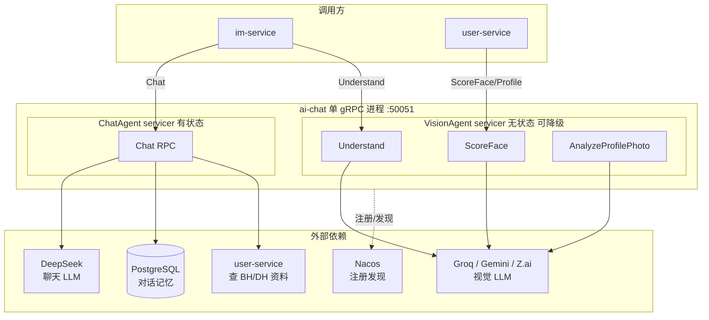
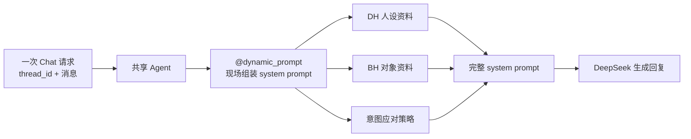
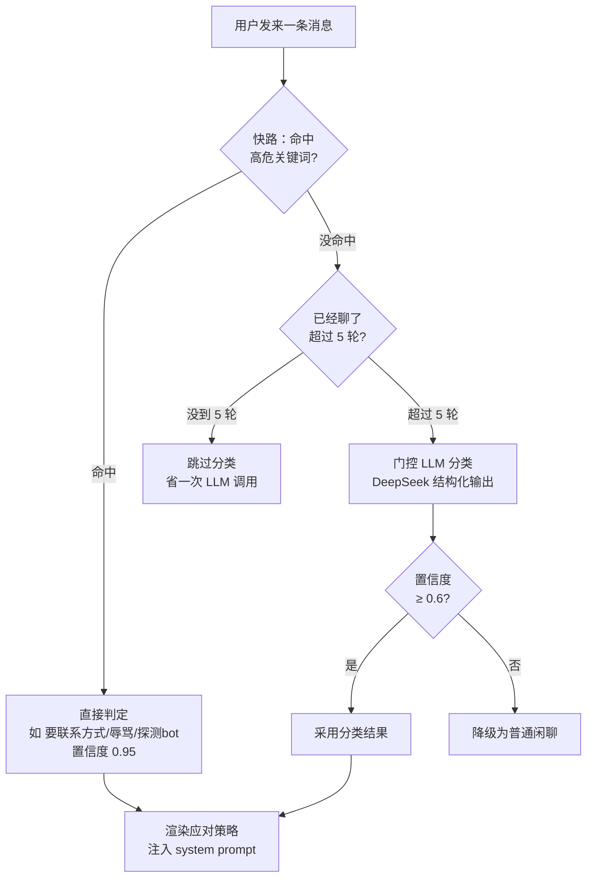
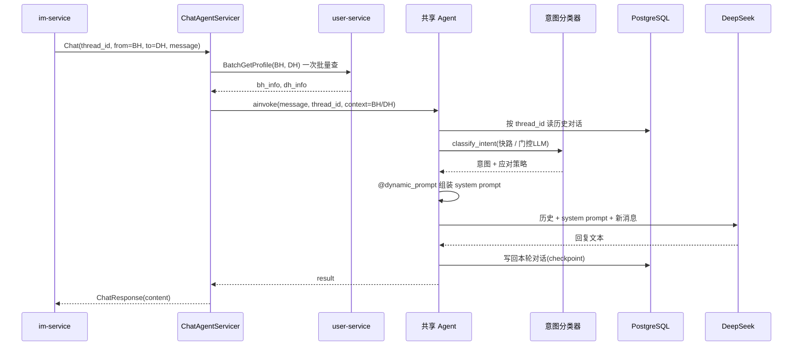

# ai-chat 技术方案：拟人化聊天 + 图像分析 AI 服务

> 配套：`im-service-design.md`（im-service 调 ai-chat 生成 DH 回复 / 图片理解）、`match-service-prd-tech.md`（DH 数字人体系）、`user-service-design.md`（查 BH/DH 资料）。
>
> 本文基于 `ai-chat/` 当前代码现状整理，面向没接触过 LangChain/LangGraph 的读者也能看懂。ai-chat 内部另有一批更细的设计文档（`ai-chat/docs/*.md`），本文是**总览 + 亮点串讲**。

## 0. 一分钟看懂它是干嘛的

平台里有两类"人"：

- **BH（BioHuman）** — 真人用户。
- **DH（DigitalHuman）** — 数字人，其实是 AI 扮演的虚拟人设。

真人在 App 上刷到的一部分"对象"其实是 DH。当真人给 DH 发消息、或平台想给某张照片打颜值分时，就来找 **ai-chat**。它干两件事：

| 能力 | 说白了 | 谁调它 |
|---|---|---|
| **ChatAgent（拟人聊天）** | 你给"她"发消息，AI 以这个数字人的身份、口吻、人设生成一条**像真人**的回复 | im-service（真人 BH→DH 发消息时） |
| **VisionAgent（图像分析）** | 看懂图片：描述图片内容 / 给脸打颜值分 / 分析头像是不是真人 | im-service（图片消息）、user-service（注册审图） |

一句话：**ai-chat = "会聊天的数字人大脑" + "会看图的眼睛"，打包成一个 gRPC 服务**。

技术栈：Python 3.13 / LangChain + LangGraph（Agent 框架）/ DeepSeek（聊天 LLM）/ Groq + Gemini + 智谱 Z.ai（视觉 LLM）/ gRPC / PostgreSQL（对话记忆）/ Nacos（服务治理）。

## 1. 全局架构：一个进程，两个大脑

ai-chat 是**单个 gRPC 进程，同时挂载多个 servicer**（一个 servicer ≈ 一组 RPC 接口）。这样部署一份就够，省资源、好治理。



**两个大脑的关键区别**：

| | ChatAgent | VisionAgent |
|---|---|---|
| 有没有记忆 | ✅ 有（多轮对话，记在 PostgreSQL） | ❌ 无（每次调用独立，单轮） |
| LLM | DeepSeek（`deepseek-v4-flash`） | Groq / Gemini / Z.ai 轮询 |
| 能不能降级 | 核心，必须在 | 可选：缺依赖/缺 key 时**自动跳过**，不拖垮聊天 |
| 输出 | 一段自然语言 | 结构化（颜值分数 / 标签） |

> **优雅降级亮点**：`server/bootstrap.py` 里 vision 用 `try/except` 注册，缺 `dating-proto-...-vision` 依赖或缺 Groq/Google key 时只打个 warning，chat 照常跑。这让"聊天"这个核心能力永远不被"看图"这个附属能力连累。

启动 / 停机（`server/bootstrap.py`）也做得很稳：PG 连接池借出前探活 + TCP keepalive 防 NAT 静默断连；收到 `SIGTERM` 先从 Nacos 摘除、再优雅停机（默认 10s grace）——不会把正在处理的请求切断。

## 2. ChatAgent：怎么让 AI 聊得像真人

这是 ai-chat 最有含金量的部分。核心挑战：**同一个 AI，要同时扮演成千上万个不同的数字人，对成千上万个不同的真人说话，还不能露馅。**

### 2.1 亮点一：一个 Agent 服务所有人（动态 Prompt）

最朴素的做法是"每个数字人建一个 agent"，但那样内存会爆。ai-chat 的做法是：**全局只建一个 agent，靠"动态 system prompt"在每次请求时临时"换皮"。**

关键在 `@dynamic_prompt` 装饰器（`chat_agent/builder.py`）：agent 每次要调 LLM 前，都会回调 `user_persona_prompt()`，现场把这次对话的 DH 人设、BH 资料、应对策略拼成 system prompt。



system prompt 模板（`chat_agent/prompts/system.md`）里留了三个占位符，请求时替换：

| 占位符 | 填什么 |
|---|---|
| `{{DH_USER_INFO}}` | DH 的资料 —— "**你就是这个人**"（AI 要扮演的人设：昵称/年龄/职业/兴趣/所在地时间…） |
| `{{BH_USER_INFO}}` | BH 的资料 —— "你正在跟这个人说话"（对话对象） |
| `{{INTENT_CONTEXT}}` | 意图分类器算出的"这句话该怎么应对"（见 2.3） |

> ⚠️ 一个容易踩的坑：`build_system_prompt(from_user=DH, to_user=BH)` 的 from/to 和 gRPC `ChatRequest` 里的 from/to **含义相反**。ChatRequest 里 from=发消息的真人；但生成回复时，"说话方"是 DH。代码注释专门标了这点。

### 2.2 亮点二：人设是"活的"（分阶段 + 时区 + 动态资料）

光有资料不够，`system.md` 把"怎么演"也写死成规则，让 DH 像真人：

- **分阶段对话**：第 1–5 轮"冷开场"（短、别热情过头、镜像对方能量）；6–20 轮"升温"；21 轮+"熟络"（可以调情、可以有情绪）。避免 AI 一上来就热情似火的塑料感。
- **语气动态**：对方冷淡你也冷淡，对方有趣你才展开，对方无礼你要发火——一张 tone 表映射。
- **反 AI 味**：明令禁止 "That's interesting! Tell me more." 这种机器腔，要求用小写、俚语、口语、短句（<15 词）。
- **知道"现在几点"**：`core/time_utils.py` 用用户经纬度（`tzfpy`）或美国州码反查时区，渲染出**模糊本地时间**（"Wednesday, 2026-06-04 3 o'clock PM in the afternoon"）塞进资料。这样 DH 能自然说出"这么晚还没睡?"，而不是永远活在服务器 UTC 时间里。

还有个**省钱小心机**（`format_user_info`）：静态字段（名字/年龄）放前面，每次都变的 `current_time` 放最末尾——这样 prompt 前缀稳定，能最大化命中 LLM 的 **prompt cache**，降本降延迟。

### 2.3 亮点三：意图识别的"两级火箭"（省钱又安全）

真人可能发各种消息：正常闲聊、调情、要微信、探测你是不是 bot、辱骂… 不同意图要用不同策略应对。但**每条消息都跑一次 LLM 分类太贵**。ai-chat 用两级降级（`chat_agent/intent_classifier.py`）：



- **第一级：关键词快路（永远先跑）**。像"send nudes"、"your instagram"、"are you real"这类**高危**内容，用关键词直接命中，`confidence=0.95`，**不等 LLM**——安全的事零延迟拦下。
- **第二级：门控 + LLM**。只有对话**超过 5 轮**（`GATING_THRESHOLD`）才启用 LLM 精细分类。冷启动阶段（前几轮就是普通打招呼）根本不调 LLM，省钱。
- **兜底**：LLM 置信度 < 0.6 时降级成 `casual_chat`，避免低质量分类瞎指挥。

分类结果（9 种意图 + escalating/deflecting/boundary_testing 三个信号旗标）会被 `build_intent_context()` 渲染成一段**应对指南**塞进 system prompt。例如判定为 `personal_info`（要联系方式），就注入"硬边界，礼貌但坚决拒绝，别留余地"——这跟 im-service 的反导流（§见 im-service-design.md §11）在两个服务里双保险。

### 2.4 亮点四：聊得再久也不爆（自动摘要压缩）

多轮对话越聊越长，全塞给 LLM 又贵又会超 context。`build_agent` 挂了 `SummarizationMiddleware`：

- 当消息累计到 **200 条**触发，把老对话压缩成摘要，只**保留最近 40 条**原文。
- 摘要用专门的 prompt（`dating_summary_prompt.md`）：提炼"DH 说过什么 / BH 透露了什么 / 关系进展到哪了"，只留对后续对话有用的信息。

这样一段对话可以近乎无限地聊下去，成本和延迟却被摁住。

### 2.5 ChatAgent 完整请求流程



对话记忆靠 LangGraph 的 **checkpointer**：本地调试用 `InMemorySaver`（重启就丢），生产用 `AsyncPostgresSaver`（落 PostgreSQL）。不同对话用 `thread_id`（im-service 传的 `fromUserId:toUserId`）互相隔离，`checkpointer.setup()` 幂等建表、重启安全。

## 3. VisionAgent：会看图的眼睛

VisionAgent 提供三个**无状态单轮** RPC（不需要记忆，看一次答一次）：

| RPC | 干嘛 | 输出 |
|---|---|---|
| `Understand` | 按 prompt 描述/分析图片 | 一段自然语言（im-service 拿去喂给 DH "看懂"用户发的图） |
| `ScoreFace` | 颜值打分 | `status` / `appearance` / `sexual_attractiveness_score`，均 0–100 |
| `AnalyzeProfilePhoto` | 头像分析 | `描述\|标签` / `not_human` / `anime_human` |

后两个用 **结构化输出**（`response_format` 绑 Pydantic schema，`vision_agent/schemas.py`），保证返回的是能直接用的字段而不是一段要正则解析的文本。颜值分还做了 `_clamp` 保护：非法值静默夹到 0–100，不抛错、不触发重试。

### 3.1 亮点五：多模型智能路由 + 熔断（SmartRouter）

视觉 LLM 是第三方服务，会限流、会抽风。ai-chat 自研了 `SmartRouterMiddleware`（`core/middlewares/smart_router.py`）在 **Groq / Gemini / Z.ai** 之间智能调度：

```mermaid
flowchart TD
    req[一次视觉请求] --> pick[按 round_robin<br/>轮询选下一个模型]
    pick --> avail{该模型在<br/>熔断冷却中?}
    avail -->|是| skip[跳过它]
    avail -->|否| call[调用模型]
    skip --> next[试下一个候选]
    call --> ok{成功?}
    ok -->|成功| done[返回结果<br/>错误计数清零]
    ok -->|失败| err[错误计数+1<br/>连续 3 次→熔断 30s]
    err --> next
    next --> more{主池还有<br/>候选?}
    more -->|有| avail
    more -->|主池耗尽| fb{有兜底模型?}
    fb -->|有| call
    fb -->|无| raise[全失败才抛错]
```

几个设计点：

- **round_robin 轮询**：请求轮流分发到各模型，天然分摊压力、绕过单家限流。
- **熔断**：一个模型连续错 3 次（`error_threshold`），冷却 30s（`cooldown_seconds`）内不再选它，成功一次就清零。坏掉的模型自动被"隔离"，好了自动恢复。
- **兜底层（fallback_models）**：只有主池全部失败/全在冷却时才启用。当前留空（DeepSeek 还没多模态模型），机制就位，将来接一行代码即可。
- **全部失败才抛错**：把"某家抽风"对调用方完全隐藏。

### 3.2 亮点六：自己 fetch 图片再喂给 LLM

图片 URL 常常是 OpenIM 的 `/object/<name>`，它会 **302 跳转**到 iDrive 直链，而 Groq/Gemini **不 follow 重定向**，直接喂 URL 会失败。`image_message()` 的解法：ai-chat 自己用 httpx（`follow_redirects=True`）把图片下载下来，转成 **base64 data URL 内联**给 LLM。顺带按 content-type / 扩展名兜底猜 MIME。多张图并发下载（`asyncio.gather`）。

## 4. 服务治理：Nacos 注册发现 + 热更新

ai-chat 用 Nacos 做服务注册与发现（`core/nacos_client/`），跟 Java 服务一致：

- **注册**：启动后把自己（服务名 `ai-chat`）注册到 Nacos，`namespace=youjianxin-dating-dev`，im-service 靠 `discovery:///ai-chat` 就能找到它。
- **发现 + 热更新**：ai-chat 反过来要调 user-service，用 `ServiceResolver` 订阅 user-service 的地址变更。热路径 `current()` 是零开销线程安全读；只有连接出错（`UNAVAILABLE`/`DEADLINE_EXCEEDED`）才 `refresh()` 重查 Nacos 并**重连重试一次**——业务错误（NOT_FOUND 等）不重试，直接抛。
- **可选接入**：没配 `NACOS_SERVER_ADDR` 就回退静态直连（`USER_SERVICE_ADDR`），本地开发友好。

## 5. 配置一览

关键环境变量（`core/config.py` / `env.example`）：

| 变量 | 用途 |
|---|---|
| `DEEPSEEK_API_KEY` | ChatAgent 聊天 LLM |
| `GROQ_API_KEY` / `GOOGLE_API_KEY` / `ZAI_API_KEY` | VisionAgent 三家视觉 LLM |
| `GROQ_VISION_MODEL` / `GEMINI_VISION_MODEL` / `ZAI_VISION_MODEL` | 视觉模型 id（env 可覆盖） |
| `PG_USER` / `PG_PASSWORD` / `PG_HOST` / `PG_PORT` / `PG_DB` | 对话记忆 PostgreSQL（默认库 `youjianxin-dating-dev`） |
| `USER_SERVICE_ADDR` | user-service 直连地址（无 Nacos 时） |
| `NACOS_SERVER_ADDR` / `NACOS_NAMESPACE` / `NACOS_SERVICE_NAME` | 服务治理（不配则不接入） |
| `GRPC_LISTEN_ADDR` | 监听地址，默认 `[::]:50051` |
| `LANGSMITH_*` | 可观测性追踪（可选） |
| `DH_REPLY_LANGUAGE` | 本地调试让 DH 改说中文；生产留空=英文 |

> 凭据全走环境变量，不进 git（对齐 CLAUDE.md 红线 1）。

两种跑法：
- `chainlit run main.py` — 本地 Web UI 调试聊天（用 mock 的 BH/DH 资料 + 内存记忆）。
- `python -m server` — 生产 gRPC 服务（chat + vision）。

## 6. 亮点总结（一图流）

| 亮点 | 解决什么问题 | 在哪 |
|---|---|---|
| **动态 Prompt，单 Agent 服务全部会话** | 千人千面又不爆内存 | `@dynamic_prompt` |
| **意图识别两级火箭**（快路关键词 + 门控 LLM） | 安全零延迟 + 省钱 | `intent_classifier.py` |
| **拟人化人设**（分阶段 / 语气表 / 反 AI 味 / 本地时间） | 不露馅 | `system.md` + `time_utils.py` |
| **自动摘要压缩** | 聊多久都不超 context | `SummarizationMiddleware` |
| **SmartRouter 多模型轮询 + 熔断 + 兜底** | 视觉 LLM 抽风也不影响调用方 | `smart_router.py` |
| **自 fetch 图片转 base64** | 绕过 OpenIM 302 重定向 | `image_message()` |
| **结构化输出 + 静默夹紧** | 颜值分直接可用、不炸 | `schemas.py` |
| **优雅降级**（vision 缺 key 自动跳过） | 附属能力不拖垮核心 | `bootstrap.py` |
| **Nacos 注册发现 + resolver 热更新** | 与 Java 服务同一套治理 | `nacos_client/` |
| **prompt cache 友好排布** | 降本降延迟 | `format_user_info` |

## 7. 想深入 / 扩展看这些

- 内部细分设计：`ai-chat/docs/`（`intent-recognition-design.md` / `smart-router.md` / `smart-router-fallback.md` / `dynamic-prompt.md` / `memory-architecture.md` / `dh-persona-diversity.md` / `vision-structured-output.md` / `web-search-tools.md` / `nacos-integration.md` / `grpc-integration.md`）。
- 新增一个 Agent 的完整步骤见 `ai-chat/README.md` 的"如何新增一个 Agent"（proto 发 Nexus → 加依赖 → 建包 → `bootstrap.py` 注册 → 打包配置 → 验证）。

---

**作者**：dating-server team / 2026-07-01
**Status**：与当前代码现状对齐（持续演进中）。
