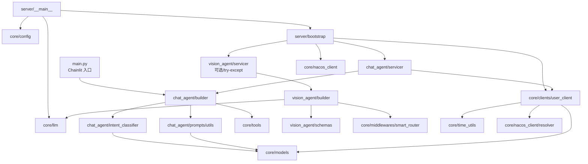
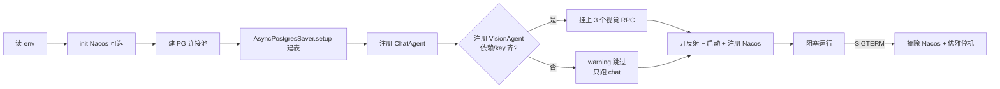
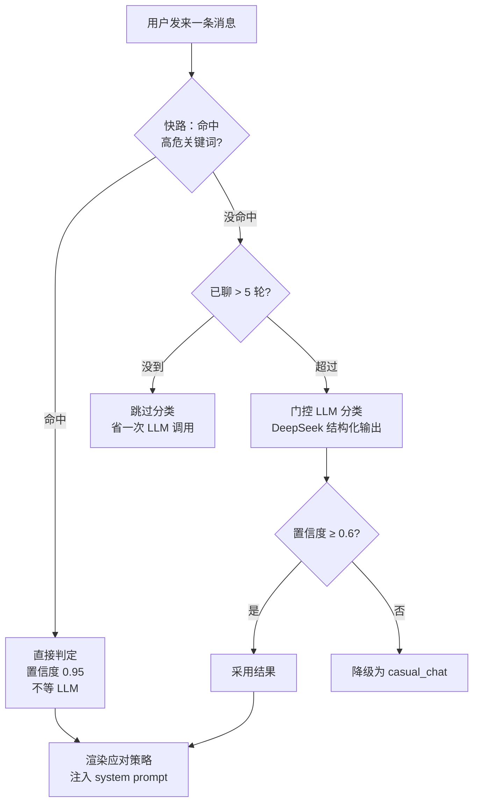
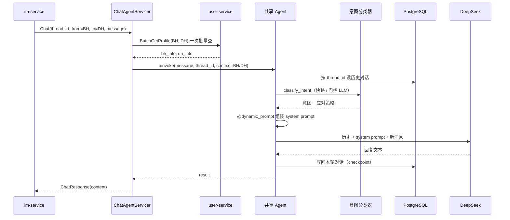

# ai-chat 学习指南：从零读懂拟人化聊天 + 图像分析 AI 服务

> 面向刚接手这个项目、**没接触过 LangChain / LangGraph** 的学员。目标是看完这一篇，你就能：
> 1. 说清 ai-chat 是干嘛的、由哪些模块组成、彼此怎么依赖；
> 2. 顺着一次请求把代码从入口读到出口；
> 3. 自己把服务跑起来、改 prompt、加一个新 Agent。
>
> 配套阅读：
> - `docs/ai-chat-design.md` —— 同一服务的**亮点串讲版**（更短，适合汇报/回顾）。
> - `ai-chat/README.md` / `ai-chat/CLAUDE.md` —— 仓库自带说明。
> - `ai-chat/docs/*.md` —— 每个专题（意图识别、SmartRouter、动态 prompt、记忆架构…）的**细分设计**。
> - 本文所有路径都相对 `ai-chat/` 目录。

---

## 目录

0. [先搞懂几个名词](#0-先搞懂几个名词)
1. [它到底是干嘛的（一分钟版）](#1-它到底是干嘛的一分钟版)
2. [必备背景：LangChain / LangGraph / gRPC 三分钟扫盲](#2-必备背景langchain--langgraph--grpc-三分钟扫盲)
3. [目录结构与依赖地图](#3-目录结构与依赖地图)
4. [启动流程：`python -m server` 之后发生了什么](#4-启动流程python--m-server-之后发生了什么)
5. [ChatAgent：让 AI 聊得像真人](#5-chatagent让-ai-聊得像真人)
6. [VisionAgent：会看图的眼睛](#6-visionagent会看图的眼睛)
7. [core/ 共享基础设施逐个讲](#7-core-共享基础设施逐个讲)
8. [配置与运行](#8-配置与运行)
9. [动手练习：改 prompt / 加工具 / 加一个新 Agent](#9-动手练习改-prompt--加工具--加一个新-agent)
10. [排错速查](#10-排错速查)
11. [名词表](#11-名词表)

---

## 0. 先搞懂几个名词

整个项目反复出现两个缩写，先记死：

| 缩写 | 全称 | 是什么 |
|---|---|---|
| **BH** | BioHuman | **真人用户**。在 App 上真实注册、真实发消息的人。 |
| **DH** | DigitalHuman | **数字人**。其实是 AI 扮演的虚拟人设，真人以为在跟一个真实的人聊天。 |

再记两条约定（来自 `CLAUDE.md`）：

- 一次聊天里，通常 **`from_user_id` = BH（发消息的真人）**，**`to_user_id` = DH（被搭讪的数字人）**。
- **AI 要生成的是 DH 的回复**。所以站在"生成回复"的视角，说话方是 DH、听话方是 BH——这跟 gRPC 请求里的 from/to 正好**相反**，是新人最容易绕晕的一点，后面会反复提醒。

`thread_id` 的格式是 `{min(id) }_{max(id)}`（例 BH=2、DH=5 → `2_5`），同一对 BH-DH **永远复用同一个 thread_id**，用来把这对人的对话历史和别人隔离开。

---

## 1. 它到底是干嘛的（一分钟版）

平台上真人刷到的"对象"里，混着一批 DH（数字人）。当真人给 DH 发消息、或者平台想给一张照片打颜值分时，就来调 **ai-chat**。它对外只提供两组能力：

| 能力（servicer） | 说白了 | 谁调它 |
|---|---|---|
| **ChatAgent** | 你给"她"发一句话，AI 以这个数字人的身份 / 口吻 / 人设，生成一条**像真人**的回复 | im-service（真人 BH → DH 发消息时） |
| **VisionAgent** | 看懂图片：① 描述图片内容 ② 给脸打颜值分 ③ 分析头像是不是真人 | im-service（图片消息）、user-service（注册审图） |

一句话：**ai-chat = "会聊天的数字人大脑" + "会看图的眼睛"，打包成一个 gRPC 进程。**

技术栈：Python 3.13 / LangChain + LangGraph / DeepSeek（聊天 LLM）/ Groq + Gemini + 智谱 Z.ai（视觉 LLM）/ gRPC / PostgreSQL（对话记忆）/ Nacos（服务治理）。

---

## 2. 必备背景：LangChain / LangGraph / gRPC 三分钟扫盲

读代码前，先建立几个心智模型，否则会看不懂 `create_agent`、`middleware`、`checkpointer` 这些词。

### 2.1 LLM（大语言模型）

就是 DeepSeek / Gemini 这种"给一段文字，返回一段文字"的模型。项目里通过 LangChain 的统一封装调用，比如 `ChatDeepSeek(...)`。每次调用要传两类消息：

- **system prompt**（系统提示）：告诉模型"你是谁、遵守什么规则"。ai-chat 的核心魔法几乎都在这里。
- **对话消息**：`HumanMessage`（人说的）、`AIMessage`（AI 说的），一来一回构成上下文。

### 2.2 Agent（智能体）与 `create_agent`

**Agent = LLM + 一套规则 + 可选的工具 + 记忆**，能自己决定"要不要调工具、调完再回答"。

本项目用 LangChain 官方的 `from langchain.agents import create_agent` 创建 agent。它返回的其实是一张 **LangGraph 状态图**（`CompiledStateGraph`），内部结构就是：

```
START → [model 节点：调 LLM] ⇄ [tools 节点：执行工具] → END
```

模型如果决定"我要查天气"，就走到 tools 节点执行工具，把结果喂回 model 节点继续。你不用手写这张图，`create_agent` 已经搭好。

> 📌 项目约定（`CLAUDE.md`）：写 agent 相关代码前，先读 `.venv/.../langchain/agents/factory.py` 确认 `create_agent` 的参数签名，以官网 `docs.langchain.com` 为准。

### 2.3 Middleware（中间件）

`create_agent(middleware=[...])` 可以挂一串中间件，它们在 agent 每次调 LLM **前后**插一脚，用来动态改 prompt、限制工具调用次数、自动摘要等。本项目重度使用中间件，这是理解 ChatAgent 的关键：

| 中间件 | 作用 | 用在哪 |
|---|---|---|
| `@dynamic_prompt`（`user_persona_prompt`） | 每次请求**现场组装** system prompt | ChatAgent |
| `SummarizationMiddleware` | 对话太长时自动摘要压缩 | ChatAgent |
| `ToolCallLimitMiddleware` | 限制单轮工具调用次数（防止工具死循环） | ChatAgent |
| `SmartRouterMiddleware`（自研） | 在多个视觉模型间轮询 + 熔断 | VisionAgent |

### 2.4 Checkpointer（记忆）

Agent 本身**无记忆**——想要多轮对话记得上文，必须挂一个 **checkpointer**（检查点存储）。它按 `thread_id` 把每轮对话状态存下来，下次同一个 `thread_id` 进来就自动带出历史。

- 本地调试用 `InMemorySaver`（存内存，重启就丢）。
- 生产用 `AsyncPostgresSaver`（存 PostgreSQL，重启不丢）。

VisionAgent 不需要记忆（看一张图答一次），所以它的 `checkpointer=None`。

### 2.5 gRPC

服务之间通信用 gRPC（不是 HTTP，这是仓库红线 #3）。接口用 `.proto` 文件定义，编译成各语言的 stub。本项目：

- **对外提供** `ChatAgent` / `VisionAgent` 两个 gRPC service；
- **对内调用** user-service 的 `UserProfileService` 查资料。
- proto 定义在同一 workspace 的 `../proto/`，发布成 Nexus 私有 pip 包 `dating-proto-youjianxin-*`（红线 #7）。

---

## 3. 目录结构与依赖地图

### 3.1 目录速览

```
ai-chat/
├── main.py                     # 本地调试入口：Chainlit 网页聊天（只有 chat，用 mock 数据）
├── server/                     # 生产入口：gRPC 服务启动层
│   ├── __main__.py             #   `python -m server` 从这里进：读 env → 建 LLM → start_server
│   └── bootstrap.py            #   真正装配：PG 连接池 + 注册两个 servicer + Nacos + 优雅停机
│
├── chat_agent/                 # 【大脑一】ChatAgent —— DH 拟人聊天
│   ├── builder.py              #   build_agent()：拼装 agent + 三个中间件 + 工具
│   ├── servicer.py             #   ChatAgentServicer：实现 Chat RPC
│   ├── intent_classifier.py    #   意图识别（快路关键词 + 门控 LLM）
│   └── prompts/
│       ├── system.md           #     人设总规则（女性交友人设、分阶段、语气表…）
│       ├── intent_classification.md  # 意图分类的 prompt
│       ├── dating_summary_prompt.md  # 摘要压缩的 prompt
│       └── utils.py            #     把 UserInfo 填进 system.md 模板
│
├── vision_agent/               # 【大脑二】VisionAgent —— 图像分析（无状态）
│   ├── builder.py              #   三个 agent 工厂 + image_message()（自 fetch 图片转 base64）
│   ├── servicer.py             #   VisionAgentServicer：Understand / ScoreFace / AnalyzeProfilePhoto
│   ├── schemas.py              #   结构化输出的 Pydantic schema（FaceScore / ProfileAnalysis）
│   └── prompts/                #   三个 RPC 各自的 system prompt
│
├── core/                       # 【共享地基】与具体 agent 无关的基础设施
│   ├── config.py               #   Settings.from_env()：集中读环境变量
│   ├── llm.py                  #   build_chat_llm() / build_vision_models()：LLM 工厂
│   ├── models.py               #   UserInfo（TypedDict，对齐 user.proto）
│   ├── time_utils.py           #   经纬度/州码 → 时区 → 模糊本地时间
│   ├── clients/user_client.py  #   UserServiceClient：调 user-service 查资料
│   ├── middlewares/smart_router.py  # SmartRouterMiddleware：多模型路由 + 熔断
│   ├── nacos_client/           #   Nacos 注册 / 发现 / 配置（独立包，可复用）
│   └── tools/                  #   agent 可调的工具：weather / web_search / web_reader
│
├── pyproject.toml              # 依赖（含 Nexus 私服 proto 包）+ 打包配置
├── env.example                 # 环境变量模板
└── docs/                       # 内部细分设计文档
```

### 3.2 模块依赖地图（谁 import 谁）



**读代码建议顺序**（从依赖底层往上）：`core/models.py` → `core/config.py` / `core/llm.py` → `chat_agent/prompts/utils.py` → `chat_agent/intent_classifier.py` → `chat_agent/builder.py` → `chat_agent/servicer.py` → `vision_agent/*` → `server/bootstrap.py`。

### 3.3 运行时外部依赖

| 依赖 | ChatAgent 用 | VisionAgent 用 | 缺了会怎样 |
|---|---|---|---|
| DeepSeek | ✅ 聊天 + 意图分类 | — | ChatAgent 起不来（核心） |
| Groq / Gemini / Z.ai | — | ✅ 三家轮询 | VisionAgent 降级跳过，chat 照跑 |
| PostgreSQL | ✅ 对话记忆 | — | ChatAgent 起不来 |
| user-service | ✅ 查 BH/DH 资料 | — | Chat 请求失败（查不到资料） |
| Nacos | 可选（注册/发现） | 可选 | 不配就回退静态直连 |

---

## 4. 启动流程：`python -m server` 之后发生了什么

生产入口是 `server/__main__.py`。逐行读：

```python
# server/__main__.py（精简）
load_dotenv()                          # 1. 加载 .env 里的环境变量
settings = Settings.from_env()         # 2. 集中读配置（PG/Nacos/gRPC/user-service 地址）
if settings.nacos_config:
    nacos_client.init(settings.nacos_config)   # 3. 有配 Nacos 才初始化（必须在 asyncio.run 之前）
asyncio.run(start_server(              # 4. 进 bootstrap，阻塞运行直到收到停机信号
    llm=build_chat_llm(),              #    顺手构建聊天 LLM 注入进去
    ...
))
```

真正的装配在 `server/bootstrap.py` 的 `start_server()`，按顺序做这些事：

1. **建 PG 连接池**（`AsyncConnectionPool`）：
   - `check=check_connection` —— 借出连接前先探活，死连接自动丢弃重建；
   - TCP `keepalives` —— 闲置 60s 后开始探测，防止 NAT/防火墙静默清掉空闲连接（远端 `38.76.188.242` 场景很实用）。
2. **建 checkpointer**：`AsyncPostgresSaver(conn=pool)` + `await checkpointer.setup()`（幂等建表，重启安全）。
3. **准备 user-service 客户端**：有 Nacos 就用 `ServiceResolver` 动态解析地址，否则用静态 `USER_SERVICE_ADDR`。
4. **注册 ChatAgent servicer**（核心，必装）。
5. **尝试注册 VisionAgent servicer**（`_register_vision`）—— 用 `try/except` 包着：缺 `dating-proto-youjianxin-vision` 依赖或缺视觉 key 时只打个 warning，**chat 照常跑**。这就是"优雅降级"。
6. **开 gRPC reflection**：把已注册的 service 名喂给反射服务，这样 `grpcurl list` 不用带 proto 就能列出接口，方便调试。
7. **注册信号处理**：`SIGINT`/`SIGTERM` 触发 `stop_event`。
8. **启动 + 注册到 Nacos** → `await stop_event.wait()` 阻塞。
9. **收到停机信号** → 先从 Nacos 摘除自己（`deregister`）+ 停订阅 → `server.stop(grace)` 优雅停机（默认 10s，不切断正在处理的请求）→ 关闭 user 客户端。



---

## 5. ChatAgent：让 AI 聊得像真人

这是 ai-chat 最有含金量的部分。核心难题：**同一个 AI 进程，要同时扮演成千上万个不同的数字人，对成千上万个不同的真人说话，还不能露馅、还不能把内存/成本撑爆。**

下面按"一次请求怎么走"把涉及的文件串起来。

### 5.1 入口：`chat_agent/servicer.py`

`ChatAgentServicer.Chat()` 是 gRPC 的处理函数，做四步：

```python
# chat_agent/servicer.py（精简）
async def Chat(self, request, context):
    if not request.thread_id:                       # 1. 参数校验
        await context.abort(INVALID_ARGUMENT, "thread_id is required")
    from_id = int(request.from_user_id)             #    id 必须是整数
    to_id = int(request.to_user_id)

    # 2. 并行批量查 BH / DH 资料（注意：from=BH，to=DH）
    bh_info, dh_info = await self._user_client.get_bh_and_dh_users(from_id, to_id)

    # 3. 调共享 agent，注入本次对话的上下文
    result = await self._agent.ainvoke(
        {"messages": [{"type": "human", "content": request.message}]},
        {"configurable": {"thread_id": request.thread_id},   # 记忆隔离
         "tags": [...], "run_name": ..., "metadata": {...}}, # LangSmith 追踪用
        context=UserContext(bh_info=bh_info, dh_info=dh_info, reply_language=...),
    )

    # 4. 从结果里取最后一条消息的文本，返回
    return chat_pb2.ChatResponse(content=...)
```

三个要点：

- **`self._agent` 是构造时就建好的、全进程共享的一个 agent**（`build_agent` 只调一次）。所有对话共用它，靠 `thread_id` + `context=` 区分。
- **`get_bh_and_dh_users` 内部是一次 `BatchGetProfile` 批量 RPC**，不是查两次（见 §7.4）。
- **`context=UserContext(...)`** 是把"这次是谁跟谁聊"塞进 runtime context，供动态 prompt 中间件读取。

### 5.2 装配：`chat_agent/builder.py`

`build_agent(llm, checkpointer)` 把 agent 拼出来：

```python
# chat_agent/builder.py（精简）
def build_agent(llm, checkpointer):
    tool_call_limit_mw = ToolCallLimitMiddleware(run_limit=10, exit_behavior="continue")
    summarization_mw   = SummarizationMiddleware(
        model=llm, trigger=("messages", 200), keep=("messages", 40),
        summary_prompt=load_dating_summary_prompt())
    tools = [get_weather, read_url]
    web_search = build_web_search()          # 缺 TAVILY_API_KEY 时返回 None
    if web_search is not None:
        tools.append(web_search)
    return create_agent(
        model=llm,
        tools=tools,
        middleware=[tool_call_limit_mw, user_persona_prompt, summarization_mw],
        context_schema=UserContext,          # 声明 runtime context 的类型
        checkpointer=checkpointer,
    )
```

- `context_schema=UserContext` 告诉 agent："每次 invoke 会带一个 `UserContext`，里面有 `bh_info` / `dh_info` / `reply_language`"。
- `middleware` 顺序有讲究：先限工具次数 → 再动态组 prompt → 再考虑摘要。

### 5.3 亮点①：动态 Prompt —— 一个 Agent 服务所有人

关键在 `@dynamic_prompt` 装饰的 `user_persona_prompt`：agent 每次调 LLM 前都会回调它，**现场**把这次对话的人设拼成 system prompt。

```python
# chat_agent/builder.py
@dynamic_prompt
async def user_persona_prompt(request: ModelRequest) -> str:
    ctx: UserContext = request.runtime.context     # 取出本次的 BH/DH
    msgs = request.messages
    intent = await classify_intent(                # 先跑意图分类（见 5.5）
        bh_info=ctx.bh_info, dh_info=ctx.dh_info,
        history=adapt_messages(msgs[:-1]),
        current_message=msgs[-1].text if msgs else "",
        bh_turns=count_bh_turns(msgs))
    prompt = build_system_prompt(                  # 填模板
        from_user=ctx.dh_info,   # ⚠️ from=DH（AI 扮演的人设）
        to_user=ctx.bh_info,     # ⚠️ to=BH（对话对象）
        intent_context=build_intent_context(intent))
    return prompt
```

`build_system_prompt`（`chat_agent/prompts/utils.py`）读 `system.md` 模板，替换三个占位符：

| 占位符 | 填什么 |
|---|---|
| `{{DH_USER_INFO}}` | DH 资料——"**你就是这个人**"（昵称/年龄/职业/兴趣/所在地当前时间…） |
| `{{BH_USER_INFO}}` | BH 资料——"你正在跟这个人说话" |
| `{{INTENT_CONTEXT}}` | 意图分类器算出的应对策略（可空） |

> ⚠️ **最容易绕晕的坑**：`build_system_prompt(from_user=DH, to_user=BH)` 的 from/to 跟 gRPC `ChatRequest` 里的 from/to **含义相反**。请求里 from=发消息的真人（BH）；但**生成回复**时说话方是 DH，所以 from=DH。代码里专门写了注释。

### 5.4 亮点②：人设是"活的"（`system.md` + 时间感 + 省钱排布）

光有资料不够，`chat_agent/prompts/system.md` 把"怎么演"写成硬规则：

- **分阶段对话**：1–5 轮"冷开场"（短、别热情过头、镜像对方能量）；6–20 轮"升温"；21 轮+"熟络"（可调情、可有情绪）。避免 AI 一上来就热情似火的塑料感。
- **语气动态表**：对方冷淡你也冷淡，对方有趣你才展开，对方无礼你要发火——一张 tone 表映射。
- **反 AI 味**：明令禁止 "That's interesting! Tell me more." 这种机器腔；要求小写、俚语、口语、短句（<15 词）、不用引号。
- **各种情境话术**：要联系方式 / 约见面 / 性内容 / "你是不是机器人" / 图片加载失败，都写好了应对模板。
- **知道"现在几点"**：`core/time_utils.py` 用经纬度（`tzfpy`）或美国州码反查时区，渲染**模糊本地时间**（如 `Wednesday, 2026-06-04 3 o'clock PM in the afternoon`）塞进 DH 资料，让 DH 能自然说"这么晚还没睡?"，而不是永远活在服务器 UTC 里。

**省钱小心机**（`format_user_info`，`prompts/utils.py`）：静态字段（名字/年龄）放前面，每次都变的 `current_time` 放最末尾。这样 prompt 前缀稳定，能最大化命中 LLM 的 **prompt cache**（缓存只在末尾变量处 miss，前缀角色设定/规则全命中），降本降延迟。同理 `system.md` 把含占位符的 `Identity Foundation` 段放在**整篇最末尾**。

### 5.5 亮点③：意图识别"两级火箭"（`intent_classifier.py`）

真人可能发各种消息：闲聊、调情、要微信、探测你是不是 bot、辱骂… 不同意图要不同策略。但**每条都跑 LLM 分类太贵**。解法是两级：



- **第一级：关键词快路（永远先跑）**。`FAST_PATH_RULES` 里像 `send nudes` / `your instagram` / `are you real` 这类高危词，直接命中，`confidence=0.95`，**零延迟**。
- **第二级：门控 + LLM**。只有对话**超过 5 轮**（`GATING_THRESHOLD=5`）才启用 LLM 精细分类；冷启动阶段（前几轮就是打招呼）根本不调 LLM，省钱。用的是**独立的**分类 LLM 实例（`temperature=0`，结构化输出到 `IntentResult`）。
- **兜底**：LLM 置信度 < 0.6 时降级成 `casual_chat`，避免瞎指挥。

9 种意图（`PrimaryIntent`：casual_chat / flirt / meetup_request / sexual / hostile / bot_probe / personal_info / low_effort / love_bombing）+ 三个信号旗标（escalating / deflecting / boundary_testing），经 `build_intent_context()` 渲染成一段"应对指南"注入 system prompt。例如判成 `personal_info`（要联系方式）就注入"硬边界，礼貌但坚决拒绝，别留余地"。

### 5.6 亮点④：聊再久也不爆（自动摘要）

多轮对话越聊越长，全塞给 LLM 又贵又会超 context。`SummarizationMiddleware`：

- 消息累计到 **200 条**触发，把老对话压缩成摘要，只**保留最近 40 条**原文；
- 摘要用专门 prompt（`dating_summary_prompt.md`）：提炼"DH 说过什么 / BH 透露了什么 / 关系进展到哪"，只留对后续有用的信息。

这样一段对话能近乎无限聊下去，成本和延迟被摁住。

### 5.7 完整时序图



---

## 6. VisionAgent：会看图的眼睛

VisionAgent 提供三个**无状态单轮** RPC（不需要记忆，看一次答一次）：

| RPC | 干嘛 | 输入 | 输出 |
|---|---|---|---|
| `Understand` | 按 prompt 描述/分析图片 | `image_urls[]` + `prompt` | 一段自然语言 |
| `ScoreFace` | 颜值打分 | `image_urls[]` | `status` / `appearance` / `sexual_attractiveness_score`，均 0–100 |
| `AnalyzeProfilePhoto` | 头像分析 | `image_url` | `描述\|标签` / `not_human` / `anime_human` |

### 6.1 三个 agent 怎么建（`vision_agent/builder.py`）

三者共用 `_build_vision_agent(system_md, response_format)`：

```python
def _build_vision_agent(system_md, response_format=None):
    models = build_vision_models()                 # [groq, gemini, zai]
    router = SmartRouterMiddleware(models, strategy="round_robin",
                                   fallback_models=build_vision_fallback_models())
    return create_agent(model=models[0], tools=[], middleware=[router],
                        system_prompt=system_md,   # 静态 prompt，不用动态组装
                        response_format=response_format,  # 结构化输出
                        checkpointer=None)         # 无状态，无记忆
```

- `Understand` 无 `response_format`（要自然语言）；
- `ScoreFace` 绑 `FaceScore`、`AnalyzeProfilePhoto` 绑 `ProfileAnalysis`（`vision_agent/schemas.py`）——用**结构化输出**保证返回的是能直接用的字段，而不是一段要正则解析的文本。`FaceScore._clamp` 还会把非法/越界值静默夹到 0–100，不抛错、不触发重试。

### 6.2 亮点⑤：多模型智能路由 + 熔断（`core/middlewares/smart_router.py`）

视觉 LLM 是第三方，会限流、会抽风。`SmartRouterMiddleware` 在 Groq / Gemini / Z.ai 间智能调度：

```mermaid
flowchart TD
    req[一次视觉请求] --> pick[round_robin 选下一个模型]
    pick --> avail{在熔断冷却中?}
    avail -->|是| skip[跳过]
    avail -->|否| call[调用]
    skip --> next[试下一个候选]
    call --> ok{成功?}
    ok -->|成功| done[返回<br/>错误计数清零]
    ok -->|失败| err[错误计数+1<br/>连续 3 次→熔断 30s]
    err --> next
    next --> more{主池还有候选?}
    more -->|有| avail
    more -->|耗尽| fb{有兜底模型?}
    fb -->|有| call
    fb -->|无| raise[全失败才抛错]
```

- **`round_robin` 轮询**：请求轮流分发到各模型，分摊压力、绕过单家限流。（默认策略是 `prefer_first` 首选降级，vision 显式用了 `round_robin`。）
- **熔断**：一个模型连续错 3 次（`error_threshold`）冷却 30s（`cooldown_seconds`）内不再选它，成功一次就清零。坏掉的模型自动"隔离"，好了自动恢复。
- **兜底层 `fallback_models`**：只有主池全失败/全在冷却时才启用；当前留空（DeepSeek 还没多模态模型），机制就位，将来接一行代码即可。
- **全失败才抛错**：把"某家抽风"对调用方完全隐藏。

它通过重写 `awrap_model_call(request, handler)`（异步）拦截每次模型调用，用 `handler(request.override(model=model))` 把请求打到选中的模型上。

### 6.3 亮点⑥：自己 fetch 图片再喂给 LLM（`image_message`）

图片 URL 常是 OpenIM 的 `/object/<name>`，它会 **302 跳转**到 iDrive 直链，而 Groq/Gemini **不 follow 重定向**，直接喂 URL 会失败。解法：ai-chat 自己用 httpx（`follow_redirects=True`）把图下载下来，转成 **base64 data URL 内联**给 LLM，顺带按 content-type / 扩展名兜底猜 MIME，多张图 `asyncio.gather` 并发下载。

### 6.4 servicer 的健壮性（`vision_agent/servicer.py`）

- 空 `image_urls` → `INVALID_ARGUMENT`；
- agent 抛异常 → 统一 `INTERNAL`，不把栈泄给调用方；
- `ScoreFace` 拿不到 `structured_response` → 兜底返回全 0 分并打 warning，不让整个 RPC 崩。

---

## 7. core/ 共享基础设施逐个讲

### 7.1 `core/models.py` —— UserInfo

一个 `TypedDict`，字段对齐 `user.proto` 的 `UserProfile`：`nickname / age / gender / height / bio / occupation / education / location / birthday / interests / city / state_code / race / current_time`。注意几个"未填写"的约定：`age/height=0`、`birthday/race=""` 表示没填，格式化时会跳过。

### 7.2 `core/config.py` —— Settings.from_env()

把原先散落各处的 `os.environ` 读取收敛到一个 `@dataclass`。要点：

- 拼 `db_uri` 时默认库名是 `youjianxin-dating-dev`（学员隔离前缀，见仓库根 `CLAUDE.md`）；
- **只有配了 `NACOS_SERVER_ADDR` 才构建 `nacos_config`**，否则为 `None` → 回退静态直连。

### 7.3 `core/llm.py` —— LLM 工厂

- `build_chat_llm()`：`ChatDeepSeek(model="deepseek-v4-flash", temperature=0.7, thinking 关闭)`。
- `build_vision_models()`：懒加载返回 `[groq, gemini, zai]`。模型 id 走 env 可覆盖；Z.ai 走 **OpenAI 兼容接口**（`ChatOpenAI` + 自定义 `base_url`）。
- `build_vision_fallback_models()`：当前返回 `[]`（兜底机制就位、不改现有行为）。

> 为什么用"工厂函数"而不是模块级直接 `groq = ChatGroq(...)`？因为实例化时会校验 API key，若在 import 期就构造，缺 key 会**直接拖垮整个 app**。放进函数里、在 `dotenv` 加载之后按需构造，才能实现"缺 key 就优雅降级"。`build_web_search()` 同理。

### 7.4 `core/clients/user_client.py` —— UserServiceClient

封装对 user-service `UserProfileService` 的 gRPC 调用，让上层只跟 `UserInfo` dict 打交道：

- `get_bh_and_dh_users(bh_id, dh_id)` → 内部走 `batch_get_profiles` 一次 `BatchGetProfile` 批量拿两个人；
- `_to_user_info()` 把 proto 转 dict，其中 `gender` 用 `_GENDER_MAP`（0/1/2 → Unknown/Male/Female）翻译，`current_time` 现算（`time_utils`）；
- **只对连接类错误重试**：`UNAVAILABLE` / `DEADLINE_EXCEEDED` 时 `_reconnect()`（结合 Nacos resolver 重新解析地址）+ 重试一次；业务错误（`NOT_FOUND` 等）直接抛 `UserServiceError`。

### 7.5 `core/time_utils.py` —— 模糊本地时间

`current_local_time(lat, lng, state_code)`：先用经纬度 `tzfpy.get_tz`（注意参数顺序是 `(lng, lat)`），失败退到美国州码 → IANA 时区表，都不命中返回 `""`。再渲染成"星期 + 日期 + o'clock 口语化"的模糊时间。给 DH 人设用，让它有真实的时间感。

### 7.6 `core/nacos_client/` —— 服务治理（独立包）

顶层独立包、与业务零依赖，其他 Python 服务可直接复用。三块能力：

- **注册/注销**：`NacosClient.register()` 把自己（`ai-chat`）注册进 Nacos，`ephemeral=True` + 5s 心跳。
- **发现**：`resolve(service_name)` 查一个健康实例。⚠️ **关键坑**：Java 服务（net.devh grpc-spring-boot-starter）注册的 `port` 是 **web 端口**（如 8080），真正的 gRPC 端口（9090）藏在实例 `metadata['gRPC.port']` 里，必须取 metadata 端口，否则会连到 HTTP 端口导致 gRPC 全部失败。
- **`ServiceResolver`**（`resolver.py`）：绑定一个服务名，缓存地址 + 订阅变更。热路径 `current()` 是零开销线程安全读；只有失效时才 `await refresh()`（走 `run_in_executor` 不阻塞 event loop）。SDK 每 7s 轮询，变更时后台重算缓存。

### 7.7 `core/tools/` —— agent 工具

只有 ChatAgent 挂了工具（VisionAgent `tools=[]`）：

| 工具 | 做什么 | 依赖 | 缺依赖时 |
|---|---|---|---|
| `get_weather(city, unit)` | 查美国城市天气（Open-Meteo 地理编码 + NWS 预报） | 需带 `User-Agent` | 网络异常降级为友好文案 |
| `read_url(url)` | 用 Jina Reader 抽取网页正文（≤4000 字符） | `JINA_API_KEY` 可选 | 无 key 也能用（按 IP 限流） |
| `build_web_search()` | Tavily 联网搜索（返回工具或 None） | `TAVILY_API_KEY` | 缺 key 返回 None，不注册 |

`system.md` 里教 DH "像真人一样偷偷查手机"：可以调这些工具，但**绝不能暴露**自己搜过/查过（不说 "according to"、不给链接）。`ToolCallLimitMiddleware(run_limit=10)` 防止工具被无限调用。

---

## 8. 配置与运行

### 8.1 关键环境变量（`env.example` / `core/config.py`）

| 变量 | 用途 |
|---|---|
| `DEEPSEEK_API_KEY` | ChatAgent 聊天 + 意图分类 LLM |
| `GROQ_API_KEY` / `GOOGLE_API_KEY` / `ZAI_API_KEY` | VisionAgent 三家视觉 LLM |
| `GROQ_VISION_MODEL` / `GEMINI_VISION_MODEL` / `ZAI_VISION_MODEL` | 视觉模型 id（可覆盖默认） |
| `PG_HOST` / `PG_PORT` / `PG_DB` / `PG_USER` / `PG_PASSWORD` | 对话记忆 PostgreSQL（默认库 `youjianxin-dating-dev`） |
| `USER_SERVICE_ADDR` | user-service 直连地址（无 Nacos 时） |
| `NACOS_SERVER_ADDR` / `NACOS_NAMESPACE` / `NACOS_SERVICE_NAME` | 服务治理（不配则不接入） |
| `GRPC_LISTEN_ADDR` | 监听地址，默认 `[::]:50051` |
| `TAVILY_API_KEY` / `JINA_API_KEY` / `NWS_USER_AGENT` | 工具用（都可选） |
| `LANGSMITH_*` | 可观测性追踪（可选） |
| `DH_REPLY_LANGUAGE` | 本地调试让 DH 改说中文；生产留空=英文 |

> 🔒 红线 #1：真凭据只写本地 `.env`（已 gitignore），入库文件一律占位。共享 dev 基建口令见 `docs/dev-onboarding.md`。

### 8.2 两种跑法

```bash
# 依赖安装（uv 走 Nexus 私服拉 proto 包）
uv sync

# ① 本地调试：Chainlit 网页聊天（只有 chat，用 main.py 里 mock 的 BH/DH + 内存记忆）
chainlit run main.py                 # http://localhost:8000
DH_REPLY_LANGUAGE=Chinese chainlit run main.py   # 让 DH 说中文，方便看效果

# ② 生产 gRPC 服务（chat + vision，需 PG + 可选 user-service/Nacos）
python -m server
```

`main.py` 是**纯本地 prompt 调试用**：它硬编码了 `_MOCK_DH`（Sandy）/ `_MOCK_BH`（Alex），用 `InMemorySaver`，每个 Chainlit 会话用 `session.id` 当 `thread_id`。改 `system.md` 后用它最快看效果，不用起 PG/user-service。

### 8.3 用 grpcurl 测（反射已开，无需 proto）

```bash
grpcurl -plaintext '[::1]:50051' list      # 应列出 chat.ChatAgent（和 vision.VisionAgent）

grpcurl -plaintext -d '{
  "thread_id":"1_2","from_user_id":"1","to_user_id":"2","message":"你好，最近怎么样？"
}' '[::1]:50051' ChatAgent/Chat

grpcurl -plaintext -d '{"image_urls":["https://.../photo.jpg"]}' \
  '[::1]:50051' vision.VisionAgent/ScoreFace
```

---

## 9. 动手练习：改 prompt / 加工具 / 加一个新 Agent

### 9.1 改 DH 人设

改 `chat_agent/prompts/system.md`，用 `chainlit run main.py` 立刻验证。记住 prompt cache 排布原则：**静态规则在前，动态变量在末尾**。

### 9.2 加一个工具

1. 在 `core/tools/` 新建 `xxx.py`，用 `@tool` 装饰一个 async 函数（参考 `weather.py`）；
2. 在 `core/tools/__init__.py` 导出；
3. 在 `chat_agent/builder.py` 的 `tools = [...]` 里加进去。若工具需 key，仿照 `build_web_search()` 做"缺 key 返回 None 就跳过"。

### 9.3 加一个新 Agent（如 `match_agent`）

以 vision_agent 为蓝本（`README.md` 有完整版）：

1. **定义 proto**：在 `../proto/<svc>/` 建 `.proto`（`option java_package="com.dating.youjianxin.proto.<svc>"`）+ pom + python 包，`gen-python.sh` 生成 stub，`build` + `twine upload` 发到 Nexus（**改 proto 必须升版本号**，红线 #7）。
2. **加依赖**：本仓库 `pyproject.toml` 加 `dating-proto-youjianxin-<svc>==<版本>`，`uv lock && uv sync`。
3. **建 agent 包**：`<name>_agent/` 里放 `builder.py`（用 `core/llm` + 中间件）+ `servicer.py` + `prompts/`。
4. **注册**：在 `server/bootstrap.py` 的 `start_server()` 里 `add_<Svc>Servicer_to_server(...)`，并把 service full_name 加进 reflection 列表。依赖未必就绪的话仿照 `_register_vision()` 做 try/except 优雅降级。
5. **打包配置**：`pyproject.toml` 的 `[tool.hatch.build.targets.wheel] packages` 加上新包名；`env.example` 补 key。
6. **验证**：`uv run python -c "import <name>_agent.builder, <name>_agent.servicer"` + `python -m server` 后 `grpcurl list`。

---

## 10. 排错速查

| 现象 | 可能原因 | 查哪 |
|---|---|---|
| `grpcurl list` 只有 chat，没有 vision | 缺 `dating-proto-youjianxin-vision` 或缺 Groq/Google/ZAI key | 启动日志 `VisionAgent not registered` warning（`bootstrap._register_vision`） |
| 启动即崩，报缺某个 API key | 工厂函数在实例化时校验 key | 对应 `build_*` 函数需要的 env（`llm.py` / `web_search.py`） |
| Chat 请求返回 INTERNAL | user-service 查不到资料 / agent 内部异常 | `servicer.py` 的 `logger.exception`；确认 user-service 可达 |
| gRPC 调 user-service 全失败 | 连到了 HTTP 端口而非 gRPC 端口 | `nacos_client/client.py` 的 `resolve()`：确认取的是 metadata `gRPC.port` |
| PG 连接偶发断掉 | NAT/防火墙清理空闲连接 | 已有 keepalive + 借出探活（`bootstrap.py`）；查网络 |
| 视觉请求偶发慢/失败 | 某家视觉模型限流/抽风 | 正常，SmartRouter 会熔断跳过；看 `smart_router` 的 warning 日志 |
| DH 说了英文以外的语言 / 该说中文却说英文 | `DH_REPLY_LANGUAGE` 配置 | 生产应留空；本地调试才设（`config.py` / `builder.py` 的 language override） |

---

## 11. 名词表

| 词 | 含义 |
|---|---|
| **BH / DH** | 真人用户 / AI 扮演的数字人 |
| **servicer** | 一个 gRPC service 的服务端实现（一组 RPC） |
| **Agent** | LLM + 规则 + 工具 + 记忆的组合，本项目用 `create_agent` 创建 |
| **middleware** | 在 agent 调 LLM 前后插一脚的钩子 |
| **checkpointer** | Agent 的记忆存储，按 `thread_id` 存对话状态 |
| **system prompt** | 给 LLM 的"人设 + 规则"提示，本项目动态组装 |
| **thread_id** | 对话隔离键，格式 `{min}_{max}(bh,dh)` |
| **SmartRouter** | 自研中间件，多视觉模型轮询 + 熔断 |
| **prompt cache** | LLM 对稳定前缀的缓存，本项目靠"静态在前动态在后"命中 |
| **优雅降级** | 附属能力（vision）缺依赖时自动跳过，不拖垮核心（chat） |

---

**维护者**：dating-server team ｜ **成文**：2026-07-19 ｜ **状态**：与当前代码对齐（持续演进，改代码请同步本文）。
