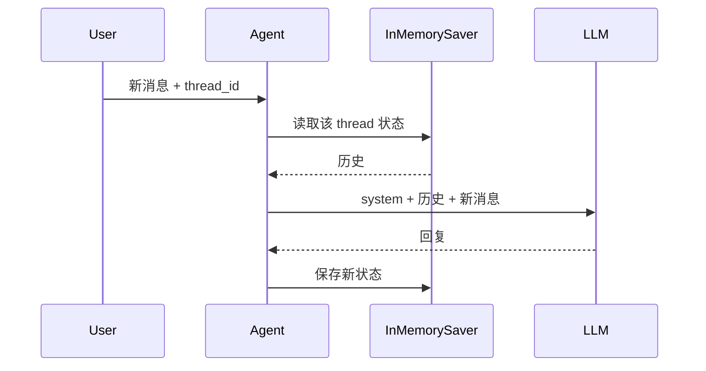
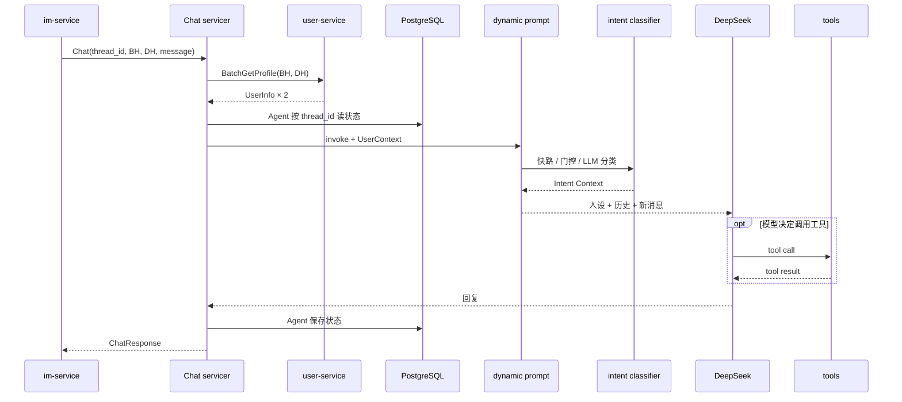

# ai-chat v1 动手学习：从最小实现逐层长成当前系统

> 这是一份“重建式阅读”教程：不要求真的创建示例文件，也不要求外部服务都可用。每一步只增加一种主要能力，再与当前 v1 源码对照。
>
> 总体拆解、实现状态和阅读顺序见 [`ai-chat-v1-incremental-learning-path.md`](./ai-chat-v1-incremental-learning-path.md)。

---

## 0. 每一步都问四个问题

1. 新增了什么能力？
2. 数据从哪里进、从哪里出？
3. 状态存在哪里？
4. 失败时谁负责处理？

示例省略了日志和生产配置，但类名、调用方向与当前代码一致。

**路径约定：** 本文路径以仓库根目录 `putao-workspace/` 为起点；示例是教学简化，不保证仓库中存在完全相同的中间版本。


## 1. Step 0：最小单轮聊天

**源码定位：** `ai-chat/core/llm.py` 的 `build_chat_llm()`；调用位置见 `ai-chat/main.py` 和 `ai-chat/server/__main__.py`。


```python
import asyncio
from langchain_core.messages import HumanMessage, SystemMessage

from core.llm import build_chat_llm


async def main():
    llm = build_chat_llm()
    result = await llm.ainvoke([
        SystemMessage(content="You are Sandy. Reply casually and briefly."),
        HumanMessage(content="how was your day?"),
    ])
    print(result.content)


asyncio.run(main())
```

此时只有：

```text
固定人设 + 一条用户消息 → DeepSeek → 一条回复
```

- 状态：无；
- 外部依赖：DeepSeek；
- 失败边界：调用代码直接收到模型异常。

对照 `ai-chat/core/llm.py`：

- 模型为 `deepseek-v4-flash`；
- `temperature=0.7`；
- thinking 关闭；
- key 在实例化时读取。

工厂函数延后模型实例化，避免 import 时就因缺 key 失败。

## 2. Step 1：用 `create_agent` 包住模型

**源码定位：** `ai-chat/chat_agent/builder.py` 的 `build_agent()`；静态 Prompt Agent 可参考 `ai-chat/vision_agent/builder.py` 的 `_build_vision_agent()`。本 Step 是教学拆分，仓库没有单独保留这个极简版本。


```python
from langchain.agents import create_agent


agent = create_agent(
    model=build_chat_llm(),
    tools=[],
    system_prompt="You are Sandy. Reply casually and briefly.",
    checkpointer=None,
)

result = await agent.ainvoke({
    "messages": [{"type": "human", "content": "how was your day?"}]
})
print(result["messages"][-1].content)
```

新增的是 LangGraph 执行壳：

```text
START → model → END
```

`create_agent` 不会自动带来业务能力。人设来自 Prompt，记忆来自 checkpointer，工具来自 tools，中间件来自 middleware。

验收：

- 连续调用两次不会记住第一次；
- 换固定 system prompt 后角色随之改变；
- 能说明何时才会出现 `model ⇄ tools`。

## 3. Step 2：加入本地 UI，仍保持无状态

**源码定位：** `ai-chat/main.py`，重点看 `on_message()`、`_MOCK_BH`、`_MOCK_DH`。当前文件已经加入内存记忆；“无状态”只是本 Step 的教学简化。


```python
import chainlit as cl


@cl.on_message
async def on_message(message: cl.Message):
    result = await agent.ainvoke({
        "messages": [{"type": "human", "content": message.content}]
    })
    content = result["messages"][-1].content
    await cl.Message(content=content).send()
```

Chainlit 只负责浏览器与 Python 消息处理函数之间的输入输出，不负责 Prompt、记忆或服务发现。

当前 `ai-chat/main.py` 在这个骨架上又加入了 mock BH/DH、内存记忆、动态上下文和本地语言覆盖。

## 4. Step 3：加入内存多轮记忆

**源码定位：** `ai-chat/main.py` 的 `_checkpointer = InMemorySaver()` 和 `on_message()`；`ai-chat/chat_agent/builder.py` 的 `build_agent(llm, checkpointer)`。


构建时：

```python
from langgraph.checkpoint.memory import InMemorySaver

agent = create_agent(
    model=build_chat_llm(),
    tools=[],
    system_prompt="You are Sandy. Reply casually and briefly.",
    checkpointer=InMemorySaver(),
)
```

调用时：

```python
result = await agent.ainvoke(
    {"messages": [{"type": "human", "content": message.content}]},
    {"configurable": {"thread_id": cl.context.session.id}},
)
```



验收实验：使用 A、B 两个 thread id。在 A 中告诉模型一个信息，再分别从 A、B 询问；只有 A 应能利用该历史。

常见误解：

- `thread_id` 不是用户 id，而是会话状态分区；
- 内存只表示存储介质，重启即丢；
- 一个 Agent 可以服务多个 thread。

## 5. Step 4：从固定角色升级为动态 BH/DH

**源码定位：** `ai-chat/core/models.py` 的 `UserInfo`；`ai-chat/chat_agent/builder.py` 的 `UserContext`、`user_persona_prompt()`、`build_agent()`；`ai-chat/chat_agent/prompts/utils.py` 的 `format_user_info()`、`build_system_prompt()`；模板见 `ai-chat/chat_agent/prompts/system.md`，所在地时间见 `ai-chat/core/time_utils.py`。


当前运行时上下文：

```python
class UserContext(BaseModel):
    bh_info: UserInfo
    dh_info: UserInfo
    reply_language: str | None = None
```

先实现不带意图的动态 Prompt：

```python
from langchain.agents.middleware import ModelRequest, dynamic_prompt


@dynamic_prompt
def persona_prompt(request: ModelRequest) -> str:
    ctx: UserContext = request.runtime.context
    return build_system_prompt(
        from_user=ctx.dh_info,
        to_user=ctx.bh_info,
        intent_context="",
    )
```

装配和调用：

```python
agent = create_agent(
    model=build_chat_llm(),
    tools=[],
    middleware=[persona_prompt],
    context_schema=UserContext,
    checkpointer=InMemorySaver(),
)

await agent.ainvoke(
    {"messages": [{"type": "human", "content": "hey"}]},
    {"configurable": {"thread_id": "101_202"}},
    context=UserContext(bh_info=alex, dh_info=sandy),
)
```

`chat_agent/prompts/utils.py` 的组装链：

```text
UserInfo
  → format_user_info()
  → 人物资料块
  → 替换 system.md 中三个占位符
  → 完整 system prompt
```

三个占位符为 `{{DH_USER_INFO}}`、`{{BH_USER_INFO}}`、`{{INTENT_CONTEXT}}`。

### from/to 反转

请求中：

```text
from_user_id=101  # BH Alex
to_user_id=202    # DH Sandy
```

生成的是 Sandy 的回复，因此：

```python
build_system_prompt(
    from_user=sandy,  # DH，说话者
    to_user=alex,     # BH，对话对象
)
```

如果放反，代码仍能运行，但模型会扮演错人。

验收：同一个 Agent 传入两组 DH 资料时角色变化，但 Agent 对象不重建。

## 6. Step 5：在人设 Prompt 中加入意图

**源码定位：** `ai-chat/chat_agent/intent_classifier.py` 的 `PrimaryIntent`、`IntentResult`、`fast_path_classify()`、`should_classify()`、`classify_intent()`、`build_intent_context()`；分类 Prompt 见 `ai-chat/chat_agent/prompts/intent_classification.md`；调用位置见 `ai-chat/chat_agent/builder.py` 的 `user_persona_prompt()`。


### 6.1 先加关键词快路

```python
intent = fast_path_classify(current_message)
intent_context = build_intent_context(intent)
prompt = build_system_prompt(
    from_user=ctx.dh_info,
    to_user=ctx.bh_info,
    intent_context=intent_context,
)
```

`are you real`、`your instagram`、`send nudes` 等消息会直接得到高置信度分类；普通问候返回 `None`。

### 6.2 再加轮数门控

```python
if fast_result is not None:
    return fast_result
if bh_turns <= 5:
    return None
```

快路必须在门控前，否则早期高风险消息会被“前五轮不分类”跳过。

### 6.3 最后加结构化 LLM 分类

```python
structured_llm = intent_llm.with_structured_output(IntentResult)
result = await structured_llm.ainvoke(intent_prompt)
if result.confidence < 0.6:
    result.primary_intent = PrimaryIntent.CASUAL_CHAT
```

| 用途 | temperature | 输出 |
|---|---:|---|
| 聊天 | 0.7 | 自然语言 |
| 意图分类 | 0 | `IntentResult` |

当前完整链：

```text
messages
  → 历史适配 + BH 轮数
  → 快路 / 门控 / LLM 分类
  → Intent Context
  → 动态 system prompt
  → 聊天模型
```

动态 Prompt 可能在一次 Agent run 的多次模型调用中重复执行，这也是 v2 要把这些职责抽到请求级 Pre-Loop Hook 的原因之一。

验收：

| 场景 | 预期 |
|---|---|
| 第 1 轮普通消息 | 不分类 |
| 第 1 轮高风险关键词 | 快路命中 |
| 第 6 个 BH 历史轮次后的普通消息 | 调 LLM 分类 |
| 分类置信度 0.4 | 主意图降级为 casual_chat |

## 7. Step 6：加入工具和工具保护

**源码定位：** `ai-chat/core/tools/weather.py` 的 `get_weather()`、`ai-chat/core/tools/web_reader.py` 的 `read_url()`、`ai-chat/core/tools/web_search.py` 的 `build_web_search()`；统一导出见 `ai-chat/core/tools/__init__.py`；工具列表和 `ToolCallLimitMiddleware` 见 `ai-chat/chat_agent/builder.py`。


先注册天气工具：

```python
agent = create_agent(
    model=llm,
    tools=[get_weather],
    middleware=[persona_prompt],
    context_schema=UserContext,
    checkpointer=checkpointer,
)
```

执行路径可能变成：

```text
model → tool_call → weather HTTP → ToolMessage → model → 回复
```

再加入：

```python
ToolCallLimitMiddleware(
    run_limit=10,
    exit_behavior="continue",
)
```

当前可选搜索采用构建期条件注册：

```python
tools = [get_weather, read_url]
web_search = build_web_search()
if web_search is not None:
    tools.append(web_search)
```

失败边界：

- weather/read_url 将网络错误降级为普通文本；
- web_search 缺 key 时不注册；
- 工具调用过多由 middleware 限制。

验收：无 Tavily key 时 Agent 仍能构建；普通闲聊不应被强制调用工具。

## 8. Step 7：加入长对话摘要

**源码定位：** `ai-chat/chat_agent/builder.py` 中的 `SummarizationMiddleware`；摘要 Prompt 见 `ai-chat/chat_agent/prompts/dating_summary_prompt.md`；加载函数见 `ai-chat/chat_agent/prompts/utils.py` 的 `load_dating_summary_prompt()`。


```python
summarization = SummarizationMiddleware(
    model=llm,
    trigger=("messages", 200),
    keep=("messages", 40),
    summary_prompt=load_dating_summary_prompt(),
)
```

当前 middleware 顺序：

```python
[
    tool_call_limit_mw,
    user_persona_prompt,
    summarization_mw,
]
```

摘要前后：

```text
前：system + 很长的完整历史 + 当前消息
后：system + 老历史摘要 + 最近 40 条原文 + 当前消息
```

checkpointer 解决“历史存在哪里”，摘要解决“历史太长怎么办”。数据库持久化本身不会降低 token 消耗。

## 9. Step 8：包装成 Chat gRPC

**源码定位：** `ai-chat/chat_agent/servicer.py` 的 `ChatAgentServicer.Chat()`；`ai-chat/core/clients/user_client.py` 的 `UserServiceClient`、`batch_get_profiles()`、`get_bh_and_dh_users()`、`_to_user_info()`；注册位置见 `ai-chat/server/bootstrap.py`；proto 包依赖见 `ai-chat/pyproject.toml`。


最小形态：

```python
class ChatAgentServicer(chat_pb2_grpc.ChatAgentServicer):
    async def Chat(self, request, context):
        if not request.thread_id:
            await context.abort(
                grpc.StatusCode.INVALID_ARGUMENT,
                "thread_id is required",
            )

        bh_info, dh_info = await self._user_client.get_bh_and_dh_users(
            int(request.from_user_id),
            int(request.to_user_id),
        )

        result = await self._agent.ainvoke(
            {"messages": [{"type": "human", "content": request.message}]},
            {"configurable": {"thread_id": request.thread_id}},
            context=UserContext(bh_info=bh_info, dh_info=dh_info),
        )
        return chat_pb2.ChatResponse(
            content=result["messages"][-1].content
        )
```

对接不上 user-service 时，先用：

```python
class FakeUserClient:
    async def get_bh_and_dh_users(self, bh_id, dh_id):
        return MOCK_BH, MOCK_DH
```

真实 `UserServiceClient` 的批量链：

```text
[bh_id, dh_id]
  → BatchGetProfile
  → profiles[]
  → 按 user_id 建 map
  → 检查缺失
  → 按输入顺序返回
```

proto 转 `UserInfo` 时还会映射 gender、转换兴趣，并计算所在地模糊时间。

当前错误语义：

| 错误 | 结果 |
|---|---|
| thread id 为空 | `INVALID_ARGUMENT` |
| from/to 不是整数 | `INVALID_ARGUMENT` |
| user-service 业务错误 | `UserServiceError`，最终由 Chat 映射为 `INTERNAL` |
| user-service 连接错误 | 重连并重试一次 |
| Agent 或资料查询其他异常 | `INTERNAL` |

验收：能解释 servicer 是协议适配层，Agent 不直接依赖 protobuf request。

## 10. Step 9：把记忆换成 PostgreSQL

**源码定位：** `ai-chat/server/bootstrap.py` 的 `AsyncConnectionPool`、`AsyncPostgresSaver`、`checkpointer.setup()`；数据库配置见 `ai-chat/core/config.py` 的 `Settings.from_env()` 和 `ai-chat/env.example` 的 `PG_*`。


替换点：

```text
InMemorySaver → AsyncPostgresSaver
```

```python
checkpointer = AsyncPostgresSaver(conn=pool)
await checkpointer.setup()
```

`build_agent(llm, checkpointer)` 不关心具体存储类型。

连接池还配置了：

- 借出连接前探活；
- autocommit；
- TCP keepalive；
- min/max size。

### 一致性边界

v1 没有同 thread 串行器，可能出现：

```text
A 读取 thread T
B 也读取 thread T
A 写回
B 基于旧状态写回
```

v2 的 `ConversationLane` 设计用于解决这个问题；不要认为使用 PostgreSQL 就已经保证业务顺序。

验收：说明为什么持久化替换发生在装配层，以及 Vision 为什么不使用这个 checkpointer。

## 11. Step 10：加入完整生产装配

**源码定位：** 入口见 `ai-chat/server/__main__.py`；总装配见 `ai-chat/server/bootstrap.py` 的 `start_server()`；配置见 `ai-chat/core/config.py`；Nacos 见 `ai-chat/core/nacos_client/client.py` 和 `ai-chat/core/nacos_client/resolver.py`；重连见 `ai-chat/core/clients/user_client.py` 的 `_reconnect()`。


启动：

```text
load_dotenv
  → Settings.from_env
  → 可选 init Nacos
  → build_chat_llm
  → PG pool / checkpointer
  → UserServiceClient
  → grpc.aio.server
  → 注册 Chat
  → 尝试注册 Vision
  → reflection
  → start + 注册 Nacos
```

Nacos 有两个方向：

- ai-chat 注册自己，供 im-service 等发现；
- ai-chat 发现 user-service。

连接类错误时：

```text
关闭旧 channel
  → 读取 resolver 缓存
  → 地址未变则主动 refresh
  → 新建 channel/stub
  → 重试一次
```

业务错误不重连。Java 服务的 gRPC 端口优先读取 `metadata["gRPC.port"]`，再兼容 `gRPC_port`，最后才退到实例普通端口。

停机：

1. 从 Nacos 摘除；
2. 关闭 resolver 和订阅；
3. gRPC grace stop；
4. 关闭 user-service channel。

验收：能画出启动/停机顺序，并指出核心组件和条件启用组件。

## 12. Step 11：单独重建 VisionAgent

**源码定位：** `ai-chat/vision_agent/builder.py`、`ai-chat/vision_agent/servicer.py`、`ai-chat/vision_agent/schemas.py`、`ai-chat/vision_agent/prompts/`；模型工厂见 `ai-chat/core/llm.py`；路由见 `ai-chat/core/middlewares/smart_router.py` 的 `SmartRouterMiddleware`；条件注册见 `ai-chat/server/bootstrap.py` 的 `_register_vision()`。


### 12.1 单模型图片理解

```python
agent = create_agent(
    model=one_vision_model,
    tools=[],
    system_prompt="Describe the image accurately.",
    checkpointer=None,
)
```

Vision 是单轮、静态任务 Prompt、无工具、无记忆。

### 12.2 可靠图片输入

当前转换：

```text
URL
  → httpx follow_redirects=True
  → 图片字节
  → Content-Type / 扩展名判断 MIME
  → base64 data URL
  → HumanMessage image_url block
```

多图用 `asyncio.gather` 并发下载。这一层解决传输兼容性，不是推理问题。

### 12.3 结构化输出

`Understand` 读自然语言；另外两个绑定：

```python
response_format=FaceScore
response_format=ProfileAnalysis
```

结构化结果从 `result["structured_response"]` 读取。

`FaceScore`：

- 数值四舍五入；
- 小于 0 变 0；
- 大于 100 变 100；
- 非法值变 0。

### 12.4 SmartRouter

```python
models = [groq, gemini, zai]
router = SmartRouterMiddleware(
    models,
    strategy="round_robin",
    fallback_models=[],
)
```

Router 通过 `handler(request.override(model=model))` 替换实际模型。

请求内：

```text
轮询起点
  → 跳过冷却模型
  → 失败尝试下一个
  → 主池耗尽后尝试 fallback
  → 全部失败才抛异常
```

跨请求：

```text
失败 → 连续错误 +1
连续 3 次 → 冷却 30 秒
成功 → 错误数归零
```

当前 `build_vision_fallback_models()` 返回空列表：兜底机制存在，但没有实际兜底 provider。

### 12.5 三个 RPC

| RPC | 输入校验 | 输出 | 缺结构化结果 |
|---|---|---|---|
| `Understand` | `image_urls` 非空 | 文本 | 不适用 |
| `ScoreFace` | `image_urls` 非空 | 三个分数 | 全 0 |
| `AnalyzeProfilePhoto` | `image_url` 非空 | analysis | 空字符串 |

下载/模型异常统一映射为 `INTERNAL`。Vision 构建失败时整个 servicer 不注册，Chat 继续运行。

## 13. 合回当前 v1

**源码定位：** 最终 ChatAgent 装配见 `ai-chat/chat_agent/builder.py`；生产请求入口见 `ai-chat/chat_agent/servicer.py`；生产总装配见 `ai-chat/server/bootstrap.py`；本地简化装配见 `ai-chat/main.py`。


ChatAgent 的最终装配可概括为：

```python
def build_agent(llm, checkpointer):
    tools = [get_weather, read_url]
    web_search = build_web_search()
    if web_search is not None:
        tools.append(web_search)

    return create_agent(
        model=llm,
        tools=tools,
        middleware=[
            ToolCallLimitMiddleware(run_limit=10),
            user_persona_prompt,
            SummarizationMiddleware(
                model=llm,
                trigger=("messages", 200),
                keep=("messages", 40),
            ),
        ],
        context_schema=UserContext,
        checkpointer=checkpointer,
    )
```

一次生产 Chat：



## 14. 建议练习

**练习定位：**

| 练习 | 文件 |
|---|---|
| 记忆隔离 / 动态人设 | `ai-chat/main.py`、`ai-chat/chat_agent/builder.py`、`ai-chat/chat_agent/prompts/utils.py` |
| 意图三路径 | `ai-chat/chat_agent/intent_classifier.py` |
| fake user client | `ai-chat/chat_agent/servicer.py`、`ai-chat/core/clients/user_client.py` |
| 分数边界 / fake Router | `ai-chat/vision_agent/schemas.py`、`ai-chat/core/middlewares/smart_router.py` |


1. **记忆隔离**：两个 thread id 证明历史不串。
2. **动态人设**：一个 Agent 传两个 DH，观察 Prompt/回复差异。
3. **意图三路径**：测试关键词快路、前五轮门控、低置信度降级。
4. **fake user client**：不连 user-service 测 from/to 和 thread id 透传。
5. **分数边界**：验证 `-10→0`、`50.6→51`、`120→100`、`"bad"→0`。
6. **fake SmartRouter**：A 永远失败、B/C 成功，验证切换、轮询和熔断。

仓库当前没有正式 `tests/`，这些练习也是最适合补入的第一批隔离测试。

## 15. 从 v1 读向 v2

**设计文档定位：** `doc/specs/ai-chat-v2-design.md`，重点看 §7 ConversationLane、§9 Hook、§11 SafetyReviewHook、§14 主动消息、§20 落地路线。


| v1 观察 | v2 的设计回答 |
|---|---|
| 动态 Prompt 混合资料、意图、Prompt 组装 | 拆成 Pre-Loop Hooks |
| 一次 run 可能多次执行动态 Prompt | 请求级 Hook 只执行一次 |
| 同 thread 并发可能竞争 checkpoint | `ConversationLane` |
| 安全主要靠 Prompt | `SafetyReviewHook` |
| 只处理被动 Chat | 主动消息 scheduler/dispatcher |
| Chat 固定单模型 | SmartRouter 扩展到 Chat |

v2 的价值不是类更多，而是把 v1 已出现的职责和并发问题显式分层。

## 16. 完成标准

能不看文档回答以下问题，就掌握了 v1 主体：

1. 为什么一个 Agent 能扮演多个 DH？
2. `thread_id`、`UserContext`、system prompt 分别是什么？
3. 意图快路为什么必须先于门控？
4. checkpointer 和摘要分别解决什么问题？
5. ChatRequest 的 from/to 为什么在 Prompt 组装时反过来？
6. 缺 Tavily key、Vision key、PostgreSQL 的后果分别是什么？
7. user-service 哪些错误会重连？
8. Vision 为什么无记忆、为什么需要结构化输出？
9. SmartRouter 的请求内切换和跨请求熔断有什么区别？
10. 哪些能力已实现，哪些只是 v2 设计？
