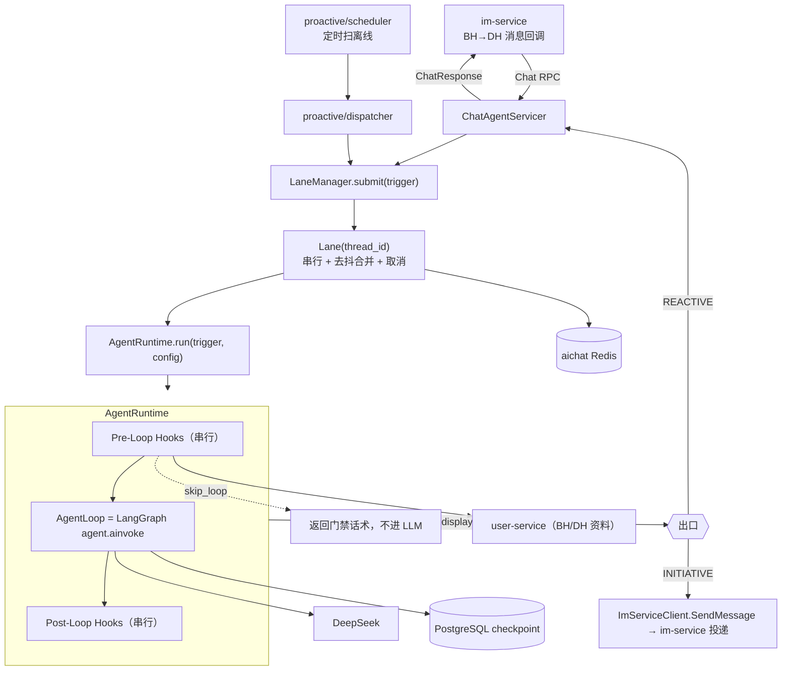
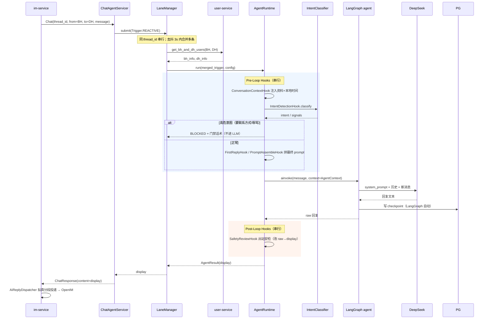
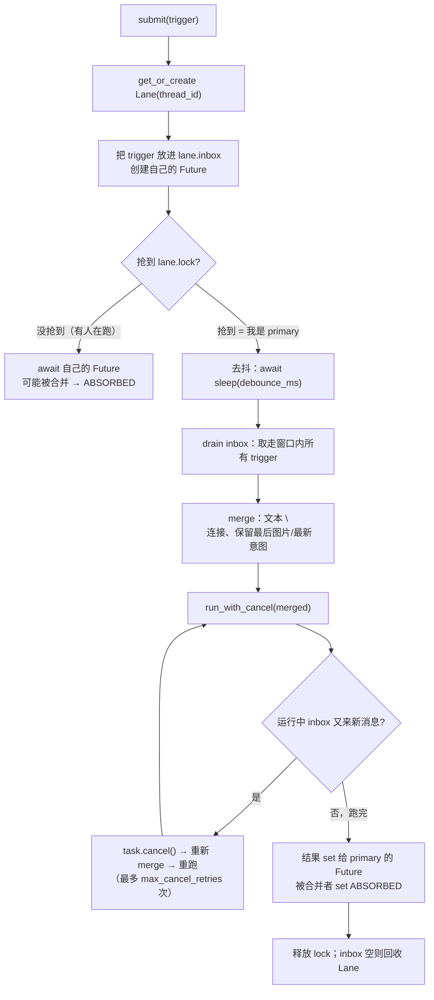
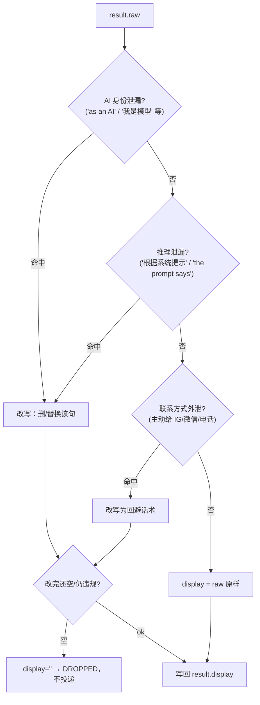
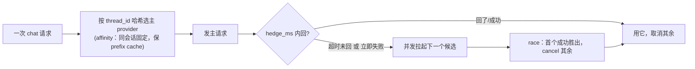
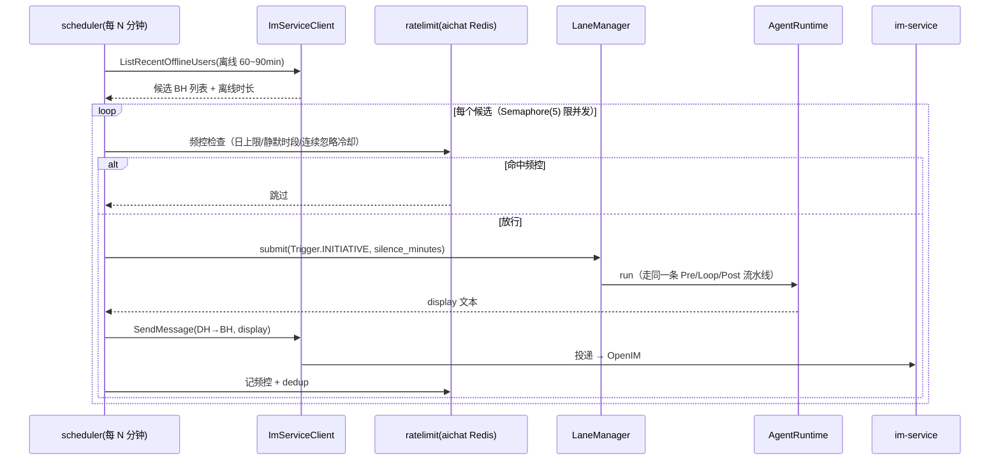

# ai-chat v2 技术设计方案

> 姊妹篇：`ai-chat-design.md`（现状概览）、`im-service-design.md`（投递 / typing / presence / 反导流）、`user-service-design.md`（BH/DH 资料）。
>
> 本文是 ai-chat 下一版的**落地设计**：从现状「一个 middleware 堆叠的共享 agent」升级为一条**有明确边界的流水线** —— 上下文注入、意图门禁、安全审核、持久化都从 agent 内部抽出来，变成独立、可测、单一职责的 Hook；同一会话的并发用 `ConversationLane` 串行保护；并新增基础主动消息能力。
>
> 读者对象：要照本文写代码的人。文中给出文件布局、数据模型、函数签名与伪码，可直接对号入座。

---

## 1. 设计目标与范围

### 1.1 要解决的四个问题

| 问题 | 现状 | v2 方案 |
|---|---|---|
| **同会话并发写坏记忆** | im-service 逐条回调 → 同 `thread_id` 并发 `Chat` → 并发写 LangGraph checkpoint，历史错乱、每条各跑一次 LLM | `ConversationLane`：按 `thread_id` 串行 + 去抖合并 + 取消在飞（§7） |
| **逻辑全塞在 `@dynamic_prompt` 里** | 意图分类、人设拼装、时间注入挤在一个 middleware，每次 model 调用都重跑，且无法在进 LLM 前拦截 | 抽成有序 **Pre-Loop Hook**，每次请求跑一次；高危意图 `skip_loop` 直接短路（§9） |
| **出站安全只靠 prompt 约束** | AI 身份泄漏 / 联系方式外泄只在 prompt 里劝阻，无代码兜底 | **Post-Loop `SafetyReviewHook`**：出站正则闸，能改写/清空回复（§11） |
| **只会被动回，用户离线就断联** | 无主动消息 | 内部调度器扫离线用户 → 生成 → 经 im-service 投递（§14） |

### 1.2 范围

**本次做（v1）**：Runtime 编排层、ConversationLane、Pre/Post-Hook 体系、SafetyReviewHook、基础主动消息、SmartRouter 接入 chat。

**预留不做（Phase+，只留 hook 位与接口，不实现）**：RAG（pgvector 语义记忆）、Meetup 约会状态机、分级 Redis Trace、多模型 Arena 评测、主动消息的多档时间窗/多版本语料。

### 1.3 技术栈

Python 3.13 / LangChain + LangGraph（agent 循环）/ DeepSeek（聊天 LLM）/ gRPC / PostgreSQL（对话记忆 checkpoint）/ Redis（lane / 主动消息频控）/ Nacos（服务治理）。复用现状的 `core/nacos_client`、`core/clients`、`core/llm`、`vision_agent`。

---

## 2. 核心设计原则

这五条贯穿全文，写代码时按它们判断「该放哪」：

1. **AgentLoop 里零业务逻辑。** LangGraph 的 model↔tools 循环只做「调模型、执行工具、收结果」。所有决策进 Hook 或 Tool。好处：循环行为稳定可预期，业务改动不碰循环。

2. **上下文预注入，不做成 tool 让 LLM 去拉。** 历史、人设、资料、时间这类「基础上下文」，在进循环前由 Pre-Hook 直接注入 prompt，而不是给 LLM 一个 `read_history` 工具让它自己「侦察」。好处：省掉「探路」轮次（每轮 LLM 往返数秒），且上下文可控、不会被模型漏读。

3. **每个 Hook 单一职责，一句话能命名。** `SafetyReviewHook` 只做安检，`IntentDetectionHook` 只做意图。名字说不清 = 揉了两件事，拆。好处：可单测、可条件装卸、顺序清晰。

4. **双通道 raw / display。** LLM 原始输出存 `raw`（模型本意），投递前文本存 `display`（安检后）。改写 raw 的 hook 必须排在生成 display 之前。好处：安检、格式化、持久化各自读对的版本，不互相踩。

5. **条件注册。** 依赖没就绪（缺 key / 缺 Redis / flag off）的 Hook/Tool **根本不进流水线**，而不是运行时报错降级。好处：本地开发天然降级，LLM 的工具 schema 永远干净。

---

## 3. 模块结构（文件布局）

在现有 `ai-chat/` 下新增 `runtime/`、`hooks/`、`proactive/`，改造 `chat_agent/`：

```
ai-chat/
├── chat_agent/
│   ├── servicer.py          # 改：Chat RPC → LaneManager.submit（不再直接 ainvoke）
│   ├── builder.py           # 改：dynamic_prompt 变薄，只回读已装配好的 prompt
│   ├── intent_classifier.py # 复用：被 IntentDetectionHook 调用
│   └── prompts/…            # 复用：system.md / utils.py
│
├── runtime/                 # 新增：编排核心
│   ├── context.py           # AgentContext / AgentResult / Trigger / TriggerType / AgentConfig
│   ├── runtime.py           # AgentRuntime.run() —— pre-hooks → loop → post-hooks
│   └── lane.py              # Lane / LaneManager —— 串行 + 去抖 + 取消
│
├── hooks/                   # 新增：所有 Hook
│   ├── base.py              # PreLoopHook / PostLoopHook Protocol
│   ├── conversation_context.py
│   ├── intent_detection.py
│   ├── first_reply.py
│   ├── prompt_assemble.py   # 最后一个 pre-hook
│   └── safety_review.py     # post-hook
│
├── proactive/               # 新增：主动消息
│   ├── scheduler.py         # 定时扫离线用户
│   ├── dispatcher.py        # 频控 + 生成 + 投递
│   └── ratelimit.py         # Redis 频控
│
├── core/
│   ├── clients/
│   │   ├── user_client.py    # 复用
│   │   └── im_client.py      # 新增：ImServiceClient（ListRecentOfflineUsers / SendMessage）
│   ├── llm.py                # 复用 build_chat_llm
│   ├── middlewares/smart_router.py  # 扩展到 chat
│   ├── nacos_client/…        # 复用
│   └── redis_client.py       # 新增：aichat Redis（lane / 频控），带隔离前缀
│
└── server/…                 # 改：bootstrap 里启动 proactive scheduler（可 flag 关）
```

---

## 4. 数据模型

`runtime/context.py`：

```python
from dataclasses import dataclass, field
from enum import Enum
from pydantic import BaseModel
from core.models import UserInfo

class TriggerType(str, Enum):
    REACTIVE = "reactive"       # BH 发消息触发
    INITIATIVE = "initiative"   # 主动消息触发

class FinishReason(str, Enum):
    COMPLETED = "completed"           # 正常出回复
    BLOCKED = "blocked"               # pre-hook 门禁短路
    DROPPED = "dropped"               # post-hook 安检清空
    ABSORBED = "absorbed"             # 被同会话后续消息合并
    ERROR = "error"

@dataclass
class Trigger:
    type: TriggerType
    thread_id: str
    bh_id: int                        # 真人
    dh_id: int                        # 数字人（AI 扮演）
    content: str                      # 用户消息 / 主动消息为空
    silence_minutes: int | None = None  # 仅 INITIATIVE：离线时长，填进 prompt

# 贯穿一次 run 的共享总线：Hook 往上挂字段，下游读
class AgentContext(BaseModel):
    trigger: Trigger
    bh_info: UserInfo
    dh_info: UserInfo
    # pre-hook 装配产物
    assembled_prompt: str = ""        # PromptAssembleHook 的最终输出
    injected_sections: list[str] = []  # 各 hook 注入的 prompt 段（按加入顺序）
    detected_intent: str | None = None
    intent_signals: dict = {}
    is_first_reply: bool = False
    # 门禁
    skip_loop: bool = False
    skip_reason: str | None = None
    # trace 回填（每个 hook 自己写）
    last_hook_outcome: str = "pass"   # pass / inject / skip / block

@dataclass
class AgentResult:
    finish_reason: FinishReason
    raw: str = ""                     # LLM 原始回复
    display: str = ""                 # 安检后、投递用文本
    trace_id: str = ""

@dataclass
class AgentConfig:
    persona: str = "default"
    max_turns: int = 10
    timeout_s: float = 60.0
    debounce_ms: int = 3000
    interruptible: bool = True        # 允许被同会话新消息取消
```

---

## 5. 整体架构



**两个入口，一条流水线**：被动请求从 `Chat` RPC 进；主动消息从内部调度器进。二者都汇入 `LaneManager` → 同一条 `AgentRuntime` 流水线。区别只在 `Trigger.type` 与出口（被动回给 RPC 调用方，主动经 im-service 投递）。

---

## 6. 被动请求生命周期（时序）



> **投递分段仍在 im-service**（`SentenceSplitter` + `AiReplyDispatcher` 拟真三件套）。ai-chat 返回**一段安检后的完整文本**，不重复做分段。若将来要 ai-chat 控制气泡边界，再在 `ChatResponse` 加 `repeated string segments`（Phase+，见 §18）。

---

## 7. ConversationLane：同会话串行 + 去抖合并 + 取消

`runtime/lane.py`。这是 v2 优先级最高的一块，修的是现状真实存在的并发写坏 checkpoint 的 bug。

### 7.1 三个机制



- **串行**：每个 `thread_id` 一把 `asyncio.Lock`。同会话永不并发（保护 checkpoint），不同会话完全并行。
- **去抖合并**：primary 抢到锁后先 `sleep(debounce_ms)`，把这期间到达的消息一次性合并成单次 LLM 调用。避免用户连发 3 条 → 跑 3 次。
- **取消在飞**：LLM 运行时后台每 200ms 探 inbox；有新消息就 `cancel` 当前 task、合并后重跑。**checkpoint 只在 run 正常完成时落**，取消途中不落，保证下一轮看到的历史是「真正回过的话」。

### 7.2 伪码

```python
class Lane:
    def __init__(self, thread_id, cfg):
        self.thread_id = thread_id
        self.lock = asyncio.Lock()
        self.inbox: list[tuple[Trigger, asyncio.Future]] = []
        self.cfg = cfg

class LaneManager:
    def __init__(self, runtime, cfg):
        self._lanes: dict[str, Lane] = {}
        self._runtime = runtime
        self._cfg = cfg

    async def submit(self, trigger: Trigger) -> AgentResult:
        lane = self._lanes.setdefault(trigger.thread_id, Lane(trigger.thread_id, self._cfg))
        fut = asyncio.get_event_loop().create_future()
        lane.inbox.append((trigger, fut))

        async with lane.lock:
            if fut.done():                       # 已被前一个 batch 合并处理
                return fut.result()
            await asyncio.sleep(self._cfg.debounce_ms / 1000)  # 去抖
            batch = lane.inbox[:]; lane.inbox.clear()          # drain
            merged = merge_triggers([t for t, _ in batch])
            result = await self._run_with_cancel(lane, merged)
            for i, (_, f) in enumerate(batch):
                if not f.done():
                    f.set_result(result if i == 0 else
                                 AgentResult(FinishReason.ABSORBED))
        self._gc(lane)
        return fut.result()

    async def _run_with_cancel(self, lane, merged) -> AgentResult:
        for _ in range(self._cfg.max_cancel_retries):
            task = asyncio.create_task(self._runtime.run(merged, self._cfg))
            while not task.done():
                await asyncio.sleep(0.2)
                if lane.inbox and merged.type == TriggerType.REACTIVE:
                    task.cancel()
                    extra = lane.inbox[:]; lane.inbox.clear()
                    merged = merge_triggers([merged] + [t for t, _ in extra])
                    break
            else:
                return task.result()
        return await task            # 重试用尽，用最后一次结果
```

> **防内存泄漏**：`_gc` 在 `inbox` 空且锁空闲时删除 lane 条目。不要用无界字典长期持有会话 —— 会话是海量且长尾的。

---

## 8. AgentRuntime：编排 pre → loop → post

`runtime/runtime.py`。驱动整条流水线，串行跑 hook，负责 skip_loop 短路与 trace。

```python
class AgentRuntime:
    def __init__(self, agent, pre_hooks, post_hooks, user_client):
        self._agent = agent            # build_agent 出来的 LangGraph agent
        self._pre = pre_hooks          # 有序 list[PreLoopHook]
        self._post = post_hooks        # 有序 list[PostLoopHook]
        self._user_client = user_client

    async def run(self, trigger: Trigger, config: AgentConfig) -> AgentResult:
        bh, dh = await self._user_client.get_bh_and_dh_users(trigger.bh_id, trigger.dh_id)
        ctx = AgentContext(trigger=trigger, bh_info=bh, dh_info=dh)

        # 1) Pre-Loop：串行，任一 hook 门禁则短路
        for hook in self._pre:
            await hook(ctx)
            if ctx.skip_loop:
                return AgentResult(FinishReason.BLOCKED, display=ctx.skip_reason or "")

        # 2) AgentLoop：LangGraph 循环。agent 内薄 dynamic_prompt 回读 ctx.assembled_prompt
        if trigger.type == TriggerType.INITIATIVE and not trigger.content:
            human = "[automated] 这轮不是用户发的，按人设主动说一句，或保持沉默。"
        else:
            human = trigger.content
        out = await asyncio.wait_for(
            self._agent.ainvoke(
                {"messages": [{"type": "human", "content": human}]},
                {"configurable": {"thread_id": trigger.thread_id}},
                context=ctx,
            ),
            timeout=config.timeout_s,
        )
        raw = extract_text(out["messages"][-1])
        result = AgentResult(FinishReason.COMPLETED, raw=raw, display=raw)

        # 3) Post-Loop：串行，全跑完（安检可改写 display / 清空）
        for hook in self._post:
            await hook(ctx, result)
        if not result.display.strip():
            result.finish_reason = FinishReason.DROPPED
        return result
```

---

## 9. Hook 体系

### 9.1 接口

`hooks/base.py`：

```python
from typing import Protocol
class PreLoopHook(Protocol):
    async def __call__(self, ctx: AgentContext) -> None: ...
class PostLoopHook(Protocol):
    async def __call__(self, ctx: AgentContext, result: AgentResult) -> None: ...
```

Hook 之间不直接通信，全靠 `AgentContext` 挂字段。每个 hook 结束前写 `ctx.last_hook_outcome`（供 trace）。

### 9.2 Pre-Loop Hook（v1，按执行顺序）

| # | Hook | 读 | 写 | 职责 | 注册条件 |
|---|---|---|---|---|---|
| 1 | `ConversationContextHook` | `bh_info` `dh_info` | `injected_sections` | 注入 BH/DH 资料、DH 人设、**模糊本地时间**（`core/time_utils`，按经纬度/州码反查时区）。静态字段在前、`current_time` 在末尾，最大化 prompt-cache 命中 | 常驻 |
| 2 | `IntentDetectionHook` | `trigger` `bh_info` | `detected_intent` `intent_signals` `injected_sections`；高危→`skip_loop` | 复用 `intent_classifier`：关键词快路（高危 0.95 直判）+ 门控 LLM（>5 轮才启用）。要联系方式/辱骂→`skip_loop=True` + 门禁话术；其余→注入应对策略段 | 常驻 |
| 3 | `FirstReplyHook` | `trigger.thread_id`（查历史空否） | `is_first_reply` `injected_sections` | 首条消息 → 破冰风格提示（短、镜像能量、别热情过头） | 常驻 |
| 4 | `PromptAssembleHook` | `dh_info` `bh_info` `injected_sections` | `assembled_prompt` | **最后一个 pre-hook**：`build_system_prompt` + 拼接所有 `injected_sections`，产出最终 system prompt | 常驻 |

### 9.3 Post-Loop Hook（v1，按执行顺序）

| # | Hook | 类型 | 职责 |
|---|---|---|---|
| 1 | `SafetyReviewHook` | **改 raw→display** | 出站正则安检（§11）：AI 身份泄漏 / 推理泄漏 / 联系方式外泄。命中 → 改写或清空 `result.display`。与 im-service 反导流双保险 |

> `SaveHistory` 不单列 hook —— LangGraph checkpointer 在 `ainvoke` 内自动落库。只有将来要「可中断投递只存已投部分」时才需要专门 hook（Phase+）。

### 9.4 顺序即契约（写 Hook 列表时的硬约束）

- `ConversationContextHook`（决定历史判断依据）在 `FirstReplyHook`（读历史是否空）之前。
- `IntentDetectionHook` 的 `skip_loop` 必须在进 Loop 前生效。
- `PromptAssembleHook` **永远是最后一个 pre-hook**（消费前面所有 `injected_sections`）。
- 改写 `display` 的 hook（`SafetyReviewHook`）永远在生成最终 display 的投影之前 —— v1 只有安检，天然满足。

### 9.5 注册（条件 + 顺序，单一真相源）

`server/bootstrap.py` 里用「条件构造 + 过滤 None」建列表，这就是 hook 清单的唯一真相源：

```python
pre_hooks = [h for h in [
    ConversationContextHook(user_client),
    IntentDetectionHook(llm),
    FirstReplyHook(checkpointer),
    PromptAssembleHook(),              # 永远最后
] if h is not None]

post_hooks = [h for h in [
    SafetyReviewHook(patterns) if flags.safety_enabled else None,
] if h is not None]
```

---

## 10. AgentLoop：复用 LangGraph 循环

不自造循环。`chat_agent/builder.py` 里 `build_agent` 继续用 `create_agent`，但 **`@dynamic_prompt` 变薄** —— 真正的 prompt 装配已在 pre-hook 完成，这里只回读：

```python
@dynamic_prompt
async def assembled_prompt(request: ModelRequest) -> str:
    ctx: AgentContext = request.runtime.context
    return ctx.assembled_prompt        # pre-hook 已装配好，这里零逻辑
```

循环终止语义直接用 LangGraph 原生：**模型返回无 tool_call 的文本 = 循环结束、该文本即最终回复**。这天然满足「发完即停、不多转一圈」，无需额外处理。`ToolCallLimitMiddleware(run_limit=max_turns)` 兜底防工具死循环，`asyncio.wait_for(timeout_s)` 兜底超时。

> **落地提醒**：Pre/Post-Hook 是「每次 run 一次」语义，和现状 `@dynamic_prompt`（每次 model 调用）不同。装配逻辑要搬到 `AgentRuntime`，`dynamic_prompt` 只剩回读。动手前先读 `.venv/.../langchain/agents/middleware/` 与 `factory.py` 确认当前版本 middleware 钩子签名（项目约定：写 agent 代码前先核 API）。

---

## 11. 出站安全：SafetyReviewHook

`hooks/safety_review.py`。三类正则，命中即处置：



要点：
- **只读 `raw`、写 `display`**，不动 `raw`（双通道原则）。
- 正则字典走 **Nacos 热更新**（`safety_patterns`），新增拦截词不重启。
- 与 im-service 的入站反导流（`im-service-design.md §11`）**两个方向双保险**：入站拦用户探测，出站拦 DH 失言。

---

## 12. LLM 路由

`core/middlewares/smart_router.py` 从 vision 扩展到 chat。设计成「provider 池 + 错峰对冲」，单/多 provider 通吃：



- **v1 单 provider（DeepSeek）**：退化为「主请求 + 失败重试」，`hedge` 不触发。affinity 无副作用。
- **加第二个 chat provider 时**：错峰对冲自动生效（主超 `hedge_ms` 才拉备，谁快用谁），降尾延迟。
- **取消不泄漏连接**：对冲取消时，未胜出的 `httpx` 请求在 `finally` 里显式关闭，别让协程取消漏接 body 导致连接泄漏。

超时/降级参数（`hedge_ms`、候选顺序、per-provider timeout）走 Nacos 热更新。多模型评测（Arena）留 Phase+。

---

## 13. 记忆与历史

- **对话历史** = LangGraph `AsyncPostgresSaver` checkpointer，`thread_id` 隔离，重启保留（现状已是，保持）。
- **超长压缩** = `SummarizationMiddleware`（累计 200 条触发、保留最近 40 条，摘要 prompt 提炼「DH 说过 / BH 透露 / 关系进展」）。现状已是，保持。
- **语义记忆（RAG/pgvector）** = Phase+。预留 `RAGPrefetchHook`（pre，异步向量检索写暂存）/ `RAGIndexHook`（post，异步索引）两个 hook 位，v1 不实现。

原则复述：**别把「读记忆」做成 tool 让 LLM 自己拉**。历史与摘要都预注入，工具箱里不出现 `read_history`。

---

## 14. 主动消息

用户离线一段时间后，DH 主动发一句维系关系。

### 14.1 职责边界

| 职责 | 归属 | 理由 |
|---|---|---|
| 「谁离线了」事实源 | **im-service**（`ListRecentOfflineUsers`，已有 RPC） | presence 由 OpenIM 上下线回调维护，事实源在 im-service |
| 何时扫、追谁、追什么、频控 | **ai-chat**（调度器 + 大脑 + 自己的 Redis 频控） | 追不追是 AI 策略 |
| 投递 | **im-service**（`SendMessage`，已有 RPC） | 业务服务不直连 OpenIM（红线 #6） |

**关键：两个所需 RPC（`ListRecentOfflineUsers` / `SendMessage`）im.proto 里都已存在 → v1 主动消息不改 proto，只需 ai-chat 新增 im-service gRPC 客户端。**

### 14.2 流程



- 主动消息**复用整条 `AgentRuntime` 流水线**（同样过意图/安全 hook），只是 `Trigger.type=INITIATIVE`、`content` 为空 → runtime 注入中性系统提示 + 离线时长。
- **不会回环**：ai-chat 用 `SendMessage` 发的是 DH→BH，im-service 对 DH→BH 只落库、不再触发 AI 回复（`im-service-design.md §4.3`）。

### 14.3 频控（`proactive/ratelimit.py`，aichat Redis，带隔离前缀）

| 限制 | v1 阈值 | Redis key |
|---|---|---|
| 每 BH 每日上限 | 4 | `youjianxin-dating-dev:aichat:pro:user:{bh}:{yyyymmdd}` |
| 每 BH-DH 对每日上限 | 1 | `youjianxin-dating-dev:aichat:pro:pair:{bh}:{dh}:{yyyymmdd}` |
| 静默时段 | 用户本地 23:00–08:00 不发 | 用 `time_utils` 算本地时间 |
| 连续忽略冷却 | 连发 3 次不回 → 48h 停 | `youjianxin-dating-dev:aichat:pro:ignore:{bh}:{dh}` |

所有 key 带 TTL（对齐仓库根 `CLAUDE.md` Redis 规范）。多档时间窗（immediate/short/long）与多版本语料留 Phase+。

---

## 15. 可观测性

- **主力用 LangSmith**（`LANGSMITH_*` 开关，现状已接）：agent run / LLM call / tool call 的瀑布图零成本可得。
- **每次 run 一个 `trace_id`**（取 LangSmith run id），Runtime 在 pre/loop/post 各阶段打点；每个 hook 记 `outcome / 耗时`（写 `ctx.last_hook_outcome`）。
- **出站消息打业务标签**：`MessageType`（REACTIVE / INITIATIVE）+ dhUserId，随投递上报，供 BI/风控。
- 自研分级 Redis Trace（生产内嵌 `/api/trace` 查询）留 Phase+，v1 不做。

---

## 16. 并发纪律（asyncio）

写代码时逐条对照，避免阻塞 event loop 造成「整个进程一起慢」：

1. **NEVER 在 async 里跑同步阻塞调用**（同步 PG 驱动、`requests`、`time.sleep`）。用 `httpx.AsyncClient`、`psycopg` async、`asyncio.sleep`。必须调同步库时 `await asyncio.to_thread(...)`。
2. **每个外部调用都要超时**：`asyncio.wait_for(coro, timeout)`。user-service 5s、DeepSeek 走 `config.timeout_s`。
3. **背景任务隔离 + 限流**：主动消息扫描、RAG 索引这类背景活，用**独立 `Semaphore`**（如 `Semaphore(5)`）限并发、满了丢弃，别和被动 hot-path 抢连接。池/信号量大小写注释说明依据（峰值 QPS × 单次时长 × 余量）。
4. **背景 `create_task` 传 context**：`contextvars` 里的 LangSmith/日志上下文要显式带上，否则 trace 断成孤儿。
5. **取消要能真生效**：可取消的外部调用放在 `finally` 里释放资源（HTTP 连接、锁）。

排障纪律：先 grep 错误日志 → 判断是否多个无关模块一起慢（→共享资源争用）→ 只读诊断（`/debug`、SLOWLOG）验证假设再改代码。

---

## 17. 配置 / Nacos / 隔离前缀

- **复用** `core/nacos_client/`：注册 `ai-chat`（`namespace=youjianxin-dating-dev`）、发现 user-service / im-service（resolver 热更新，连接出错才 refresh + 重试一次）。
- **Feature flags 走 Nacos 热更新**：`proactive_enabled` / `intent_llm_enabled` / `safety_enabled` / `hedge_enabled` / `safety_patterns` / `debounce_ms` 等，改配置不重启。
- **隔离前缀严格对齐仓库根 `CLAUDE.md`**：

| 资源 | 取值 |
|---|---|
| PG 库 | `youjianxin-dating-dev`（SQL 带 dash 要双引号） |
| aichat Redis key | `youjianxin-dating-dev:aichat:<domain>:<id>`（必带 TTL） |
| Nacos namespace | `youjianxin-dating-dev` |
| 服务名 | `ai-chat`（不带前缀，靠 namespace 隔离） |
| Proto 坐标 | `dating-proto-youjianxin-*`（历史包名保留） |

---

## 18. proto 与依赖变更

| 项 | 变更 | Phase |
|---|---|---|
| `im/im.proto` | **不改**。v1 复用现有 `ListRecentOfflineUsers` + `SendMessage` | v1 |
| Python 依赖 | 新增 `dating-proto-youjianxin-im`（ai-chat 作为 im-service 的 gRPC 客户端） | v1 |
| `chat/chat.proto` | 可选：`ChatResponse` 加 `repeated string segments`（若要 ai-chat 控制气泡边界）；`ChatRequest` 加 `trigger_type`（若被动路径也要区分类型） | Phase+ |

> 改 proto 必须升版本号再发 Nexus（同版本只能发一次；见根 `CLAUDE.md` 红线 #7）。

---

## 19. 红线自检（仓库根 CLAUDE.md 8 条）

| # | 红线 | 合规 |
|---|---|---|
| 1 | 生产密码/AK/Token 不进 git | ✅ 凭据走 env/Nacos |
| 2 | 持久层禁多表 JOIN | ✅ v1 无业务多表；RAG(Phase) 单表 |
| 3 | 服务间禁 HTTP，只用 gRPC | ✅ user-service / im-service 全 gRPC |
| 4 | 禁直连别人 DB/Redis/桶 | ✅ presence 经 `ListRecentOfflineUsers`；只用自己的 aichat Redis/PG |
| 5 | 时间一律 UTC | ✅ 存储 UTC；本地模糊时间仅用于 prompt 展示 |
| 6 | 业务服务不直连 OpenIM | ✅ 主动消息经 `SendMessage` |
| 7 | proto 走 Nexus 带 youjianxin 前缀 | ✅ 复用现有；v1 不改 proto |
| 8 | 不擅自加中间件 | ✅ 只用 PG/Redis/Nacos |

---

## 20. 落地路线（每步到文件级）

| Phase | 目标 | 落地文件 | 依赖 |
|---|---|---|---|
| **P0 数据模型 + Runtime 骨架** | 行为等价现状、流水线化 | `runtime/context.py`、`runtime/runtime.py`；`builder.py` 薄化 `dynamic_prompt`；`servicer.py` 改调 Runtime | 先核 LangChain middleware API |
| **P1 拆 Hook** | 意图/人设/时间/首回复变独立 hook | `hooks/base.py` + `hooks/*.py`；`bootstrap.py` 注册 pre/post_hooks | P0 |
| **P2 ConversationLane** | **修 checkpoint 并发竞态** | `runtime/lane.py`；`servicer.py` 改调 `LaneManager.submit` | P0 |
| **P3 安全** | 出站安检双保险 | `hooks/safety_review.py`；Nacos `safety_patterns` | P1 |
| **P4 主动消息** | 基础离线追消息 | `core/clients/im_client.py`、`proactive/{scheduler,dispatcher,ratelimit}.py`、`core/redis_client.py`；`bootstrap.py` 起调度器 | P2、P3 |
| **P5 路由** | SmartRouter 接 chat + 错峰对冲 | `core/middlewares/smart_router.py`、`core/llm.py` | P0 |
| **Phase+** | RAG / Meetup / 分级 Trace / Arena / 多档主动消息 | 预留 hook 位，按需实现 | — |

---

**作者**：youjianxin-workspace / 2026-07-19
**Status**：设计草案，待评审。可据此进入 P0 编码。
